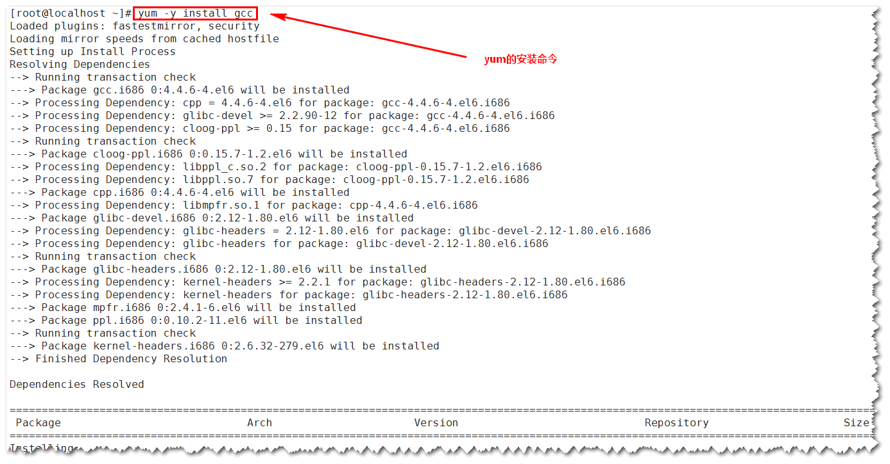
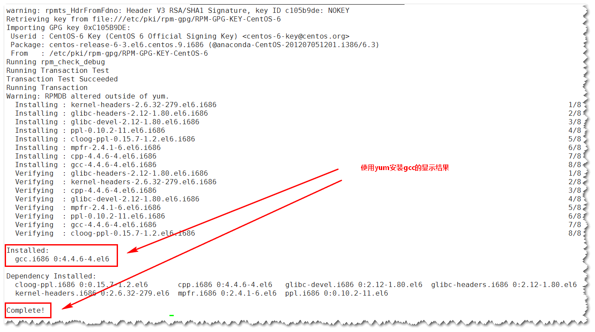
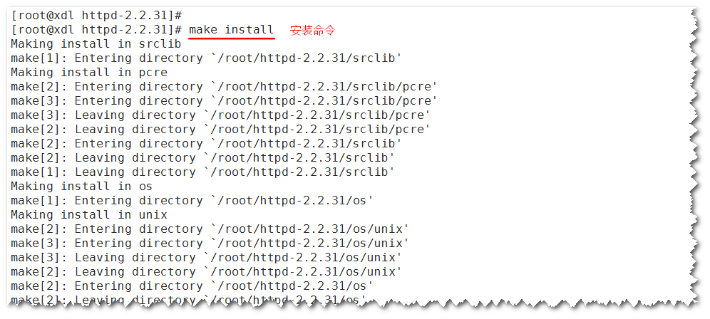

# Linux软件安装管理 #
了解Linux中的软件如何进行安装、卸载、升级等管理。课程内容包括rpm命令管理、yum在线管理、源码包管理和脚本安装包。

	一、概述
		1) Linux安装管理概述

	二、软件包管理简介
		1) Linux软件包管理之源码包
		2) Linux软件包管理之RPM包和脚本安装包

	三、rpm命令管理
		1) Linux中rpm包命名规则
		2) Linux中rpm包命令管理之安装
		3) Linux中rpm包命令管理之升级与卸载
		4) Linux中rpm包命令管理之RPM包查询
		5) Linux中rpm包命令管理之RPM包校验

	四、yum在线安装
		1) yum源文件
		2) 光盘yum源搭建
		3) yum命令

	五、源码包安装
		1) Linux中源码包与RPM包区别
		2) Linux中源码包安装过程1
		3) Linux中源码包安装过程2

	六、脚本安装包
		1) Linux中脚本安装包

## 一、概述 ##
### 1) Linux安装管理概述 ###
如何在Linux中安装软件?

windows中软件安装过程简单易用。(图形界面中点击：下一步，下一步...)

<table width="100%">
	<tr>
		<th>操作系统</th>
		<th>安装界面</th>
		<th>安装方式</th>
	</tr>
	<tr>
		<td>Windows</td>
		<td>图形化安装界面</td>
		<td>下一步，下一步</td>
	</tr>
	<tr class="red">
		<td>Linux</td>
		<td>纯字符界面</td>
		<td>命令行</td>
	</tr>
</table>

空的操作系统只能实现简单的管理，所以Linux下也需要安装软件，各种服务实际上就是各种软件。

## 二、软件包管理简介 ##
Apache安装包：<http://httpd.apache.org/> 纯源码包

### 1) Linux软件包分类 ###
- 源码包
	- 脚本安装包
- 二进制包(RPM包、系统默认包)

编译：把abcd转换成0101机器语言的过程。(windows下的软件包都是编译后的，看不到源代码。)

### 2) 各种Linux软件包的优缺点 ###
#### 2.2.1 源码包 ####
**源码包的优点：**

- 开源，如果有足够的能力，可以修改源代码
- 可以自由选择所需的功能
- 软件是编译安装，所以更加适合自己的系统，更加稳定，效率更高
- 卸载方便

**源码包的缺点：**

- 安装过程步骤较多，尤其安装较大的软件集合时(如LAMP环境搭建)，容易出现拼写错误
- 编译过程时间较长，安装比二进制安装时间长
- 因为是编译安装，安装过程中一旦报错新手很难解决

#### 2.2.2 RPM包 ####
**二进制包的优点：**

- 包管理系统简单，只通过几个命令就可以实现包的安装、升级、查询和卸载
- 安装速度比源码包安装快得多

**二进制包的缺点：**

- 经过编译，不再可以看到源代码
- 功能选择不如源码包灵活
- 依赖性

#### 2.2.3 脚本安装包 ####
所谓的脚本安装包，就是把复杂的软件包安装过程写成了程序脚本，初学者可以执行程序脚本实现一键安装。但实际安装的还是源码包和二进制包。

- 优点：安装简单、快捷
- 缺点：完全丧失了自定义性

## 三、rpm命令管理 ##
### 1) Linux中rpm包命名规则 ###
#### 3.1.1 rpm包所在的位置 ####
RPM包在系统光盘中。如下图所示

#### 3.1.2 rpm包命名原则 ####

httpd-2.2.15-15.el6.centos.1.i686.rpm

<table width="100%">
	<tr>
		<th>包命名</th>
		<th>中文解释</th>
	</tr>
	<tr class="red">
		<td>httpd</td>
		<td>软件包名</td>
	</tr>
	<tr class="red">
		<td>2.2.15</td>
		<td>软件版本</td>
	</tr>
	<tr>
		<td>15</td>
		<td>软件发布的次数</td>
	</tr>
	<tr>
		<td>el6.centos</td>
		<td>适合的linux平台</td>
	</tr>
	<tr>
		<td>i686</td>
		<td>适合的硬件平台</td>
	</tr>
	<tr class="red">
		<td>rpm</td>
		<td>rpm包扩展名</td>
	</tr>
</table>

#### 3.1.3 rpm包依赖性 ####

- 树形依赖：a→b→c
- 环形依赖：a→b→c→a
- 模块依赖：模块依赖查询网站：www.rpmfind.net

**案例：安装mysql-connector-odbc**

<table>
	<tr>
		<th>安装mysql-connector-odbc包，提示依赖库文件libodbcinst.so.2</th>
	</tr>
	<tr>
		<td></td>		
	</tr>
	<tr>
		<th>库文件libodbcinst.so.2所在的安装包</th>
	</tr>
	<tr>
		<td></td>
	</tr>
</table>

### 2) Linux中rpm包命令管理之安装 ###

#### 3.2.1 包全名与包名 ####

- 包全名：操作的包是没有安装的软件包时，使用包全名。而且要注意路径。
- 包名：操作已经安装的软件包时，使用包名，是搜索/var/lib/rpm/中的数据库。

#### 3.2.2 RPM安装 ####

<table width="100%">
	<tr>
		<th>rpm -ivh 包全名</th>
	</tr>
	<tr>
		<td>选项:  
		[-i] (install) 安装 
		[-v] (verbose) 显示详细信息 
		[-h] (hash) 显示进度 
		[--nodeps] 不检测依赖性 (逗你玩!!!)
		</td>
	</tr>
</table>

案例：安装httpd的RPM包。

<table>
	<tr>
		<th>安装httpd的RPM包</th>
	</tr>
	<tr>
		<td></td>
	</tr>
	<tr>
		<td>
备注：查询库文件libapr-l.so.0所在的安装包

		
		</td>
	</tr>
</table>

### 3) Linux中rpm包命令管理之升级与卸载 ###

<table width="100%">
	<tr>
		<th>rpm -Uvh 包全名</th>
	</tr>
	<tr>
		<td>选项： 
		[-U] (upgrade) 升级
		</td>
	</tr>
	<tr>
		<th>rpm -e 包名</th>
	</tr>
	<tr>
		<td>选项： 
		[-e] (erase) 卸载 
		[--nodeps] 不检查依赖性
		</td>
	</tr>
</table>

### 4) Linux中rpm包命令管理之RPM包查询 ###

<table width="100%">
	<tr>
		<th colspan="2">RPM包默认安装路径</th>
	</tr>
	<tr>
		<td>/etc/</td>
		<td>配置文件安装目录</td>
	</tr>
	<tr>
		<td>/usr/bin/</td>
		<td>可执行的命令安装目录</td>
	</tr>
	<tr>
		<td>/usr/lib</td>
		<td>程序所使用的函数库保存位置</td>
	</tr>
	<tr>
		<td>/usr/share/doc/</td>
		<td>基本的软件使用手册保存位置</td>
	</tr>
	<tr>
		<td>/usr/share/man</td>
		<td>帮助文件保存位置</td>
	</tr>
</table>

<table width="100%">
	<tr>
		<th>rpm -qi 包名</th>
	</tr>
	<tr>
		<td>选项： 
		[-i] 查询软件信息(information) 
		[-p] 查询未安装包信息(package)
		</td>
	</tr>
	<tr>
		<th class="red">rpm -ql 包名</th>
	</tr>
	<tr>
		<td>选项： 
		[-l] 列表(list) 
		[-p] 查询位安装包信息(package)
		</td>
	</tr>	
	<tr>
		<th>rpm -qf 系统文件名</th>
	</tr>
	<tr>
		<td>选项： 
		[-f] 查询系统文件属于哪个软件包(file) 
		</td>
	</tr>
	<tr>
		<th>rpm -qR 包名</th>
	</tr>
	<tr>
		<td>选项： 
		[-R] 查询软件包的依赖性 (requires) 
		[-p] 查询未安装包信息 (package)
		</td>
	</tr>
</table>

查询命令：

	rpm  -q  包名		查询包是否安装
	rpm  -qa  | grep  httpd 		显示所有安装包
	rpm  -qi  包名	查询包的信息		-p  未安装包
	rpm  -qip  包全名	查询没有安装包的信息
	-i	information  安装的信息
	rpm  -ql  包名	查询包中文件的安装位置
	rpm  -qlp  包全名	查询没有安装的包，打算安装位置
	-l	list
	rpm  -qf  系统文件名		查询系统文件属于哪个包

### 5) Linux中rpm包命令管理之RPM包校验 ###

#### 3.5.1 RPM包校验 ####

<table width="100%">
	<tr>
		<th>rpm -V 已安装的包名</th>
	</tr>
	<tr>
		<td>选项： 
		[-V] 校验指定RPM包中的文件 (verify)
		</td>
	</tr>
</table>

**验证内容中的8个信息的具体内容如下：**

- S 文件大小是否改变
- M 文件的类型或文件的权限(rwx)是否被改变
- 5 文件MD5校验和是否改变(可以看成文件内容是否改变)
- D 设备的主从代码是否改变
- L 文件路径是否改变
- U 文件的属主(所有者)是否改变
- G 文件的属组是否改变
- T 文件的修改时间是否改变

**文件类型：**

- c 配置文件(config file)
- d 普通文档(documentation)
- g "鬼"文件(ghost file), 很少见，就是该文件不应该被这个RPM包包含
- L 授权文件(license file)
- r 描述文件(read me)

3.5.2 RPM包中文件提取

<table width="100%">
	<tr>
		<th>rpm2cpio 包全名 | cpio -idv .文件绝对路径</th>
	</tr>
	<tr>
		<td>选项： 
		[-rpm2cpio] 将rpm包转换为cpio格式的命令 
		[-cpio] 是一个标准工具，它用于创建软件档案文件和从档案文件中提取文件
		</td>
	</tr>
	<tr>
		<th>cpio 选项 < [文件|设备]</th>
	</tr>
	<tr>
		<td>选项： 
		[-i] copy-in模式，还原 
		[-d] 还原时自动新建目录 
		[-v] 显示还原过程
		</td>
	</tr>
</table>

案例....

## 四、yum在线安装 ##
如果所有rpm包都是手工安装，则rpm包使用难度较大。

好处：将所有软件包放在官方服务器上，当进行yum在线安装时，可以自动解决依赖性问题。(redhat的yum在线安装需要付费)

备注：pkill -9 yum-updatesd	如果yum报错正在升级，执行此命令，强制杀死升级进程

### 1) yum源文件 ###

<table width="100%">
	<tr>
		<th>vi /etc/yum.repos.d/CentOS-Base.repo</th>
	</tr>
	<tr>
		<td></td>
	</tr>
</table>

<table width="100%">
	<tr>
		<td>[base]</td>
		<td>容器名称，一定要放在[]中。</td>
	</tr>
	<tr>
		<td>name</td>
		<td>容器说明，可以自己随便写。</td>
	</tr>
	<tr>
		<td>mirrorlist</td>
		<td>镜像站点，这个可以注释掉。</td>
	</tr>
	<tr>
		<td>baseurl</td>
		<td>我们的yum源服务器的地址。默认是CentOS官方的yum源服务器，是可以使用的，如果你觉得慢可以改成你喜欢的yum源地址。</td>
	</tr>
	<tr>
		<td>enabled</td>
		<td>此容器是否生效，如果不写或者写成enable=1都是生效，写成enable=0就是不生效。</td>
	</tr>
	<tr>
		<td>gpgcheck</td>
		<td>如果是1是指RPM的数字证书生效，如果是0则不生效。</td>
	</tr>
	<tr>
		<td>gpgkey</td>
		<td>数字证书的公钥文件保存位置。不用修改。</td>
	</tr>
</table>

疑问：如果没有网络，如何使用yum源？

### 2) 光盘yum源搭建 ###
**步骤：**

#### 4.2.1 挂载光盘 ####
	mkdir /mnt/cdrom
	#建立挂载点

	mount /dev/cdrom /mnt/cdrom
	#挂载光盘

> 注意：虚拟机设置，CDROM是否连接了电源

#### 4.2.2 使网络yum源失效 ####
	cd /etc/yum.repos.d/
	#进入yum源目录

	mv CentOS-Base.repo CentOS-Base.repo.bak
	#修改yum源文件后缀名，使其失效

#### 4.2.3 使光盘yum源生效 ####
	vim CentOS-Media.repo

<table width="100%">
	<tr>
		<th>vim CentOS-Media.repo</th>
	</tr>
	<tr>
		<td class="center"></td>
	</tr>
</table>

### 3) yum命令 ###

**4.3.1 常用yum命令**

<table width="100%">
	<tr>
		<th>yum list</th>
	</tr>
	<tr>
		<td>查询所有可用软件包列表</td>
	</tr>
	<tr>
		<td></td>
	</tr>
	<tr>
		<th>yum search 关键字</th>
	</tr>
	<tr>
		<td>搜索服务器上所有和关键字相关的包</td>
	</tr>
	<tr>
		<th>yum -y install 包名</th>
	</tr>
	<tr>
		<td>选项： 
		[install] 安装 
		[-y] 自动回答yes
		</td>
	</tr>
	<tr>
		<td>例子：yum -y install gcc 
		如图：yum安装gcc的命令 
		
gcc是c语言编译器，不装gcc，源码包不能安装

		 
		如图：yum安装gcc的成功显示内容 
		
		</td>
	</tr>
	<tr>
		<th>yum -y update 包名</th>
	</tr>
	<tr>
		<td>选项： 
		[update] 升级 
		[-y] 自动回答yes
		</td>
	</tr>
	<tr>
		<th>yum -y remove 包名</th>
	</tr>
	<tr>
		<td>
			选项： 
			[remove] 卸载 
			[-y] 自动回答yes
		</td>
	</tr>
	<tr>
		<td>备注：服务器使用最小化安装，用什么软件安装什么，尽量不要卸载。</td>
	</tr>
</table>

**4.3.2 YUM软件组管理命令**

<table width="100%">
	<tr>
		<th>yum grouplist</th>
	</tr>
	<tr>
		<td># 列出所有可用的软件组列表</td>
	</tr>
	<tr>
		<td class="center"></td>
	</tr>
	<tr>
		<th>yum groupinstall 软件组合</th>
	</tr>
	<tr>
		<td># 安装指定软件组，组名可以由grouplist查询出来</td>
	</tr>
	<tr>
		<th>yum groupremove 软件组名</th>
	</tr>
	<tr>
		<td># 写在指定软件组</td>
	</tr>
</table>

## 五、源码包安装 ##
### 1) Linux中源码包与RPM包区别 ###

#### 5.1.1 区别 ####
- 安装之前的区别：概念上的区别。
- 安装之后的区别：安装位置不同。

#### 5.1.2 RPM包安装位置 ####
RPM安装，是安装在默认位置

<table width="100%">
	<tr>
		<th colspan="2">RPM包默认安装路径</th>
	</tr>
	<tr>
		<td>/etc/</td>
		<td>配置文件安装目录</td>
	</tr>
	<tr>
		<td>/usr/bin/</td>
		<td>可执行的命令安装目录</td>
	</tr>
	<tr>
		<td>/usr/lib/</td>
		<td>程序所使用的函数库保存位置</td>
	</tr>
	<tr>
		<td>/usr/share/doc/</td>
		<td>基本的软件使用手册保存位置</td>
	</tr>
	<tr>
		<td>/usr/share/man/</td>
		<td>帮助文件保存位置</td>
	</tr>
</table>

<table width="100%">
	<tr>
		<th>rpm -ql 包名</th>
	</tr>
	<tr>
		<td align="center">
# 查看软件包通过rpm安装后的文件路径。如下图：

		
		</td>
	</tr>
</table>

> 备注：RPM安装默认安装在指定位置，由RPM包的作者决定一般安装在哪些目录比较适合就安装在哪些目录。RPM包也可以指定安装位置，但我们一般建议不要指定安装位置。尽管RPM包安装后文件到处都是，但是RPM包也提供了卸载命令：rpm -e 包名。如果指定了安装位置，这些卸载、启动命令可能就无法执行，所以从侧面也验证了RPM包不要指定安装位置。

#### 5.1.3 源码包安装位置 ####

安装在指定位置当中，一般是：/usr/local/软件名/ (相当于Windows下的Program Files)

> 备注：源码包安装不提供卸载命令。源码包的卸载就是直接删除安装后的目录即可。

#### 5.1.4 安装位置不同带来的影响 ####

RPM包安装的服务可以使用系统服务管理命令(service)来管理，例如：RPM包安装的apache的启动方法是：

	/etc/rc.d/init.d/httpd start
	
	service httpd start

> RPM包安装的httpd服务器，网站的根目录：/var/www/html。(关闭防火墙，网站才能访问)

而源码包安装的服务则不能被服务管理命令管理，因为没有安装到默认路径中。所以只能用绝对路径进行服务的管理，如：

	/usr/local/apache2/bin/apachectl start

### 2) Linux中源码包安装过程 ###

1、安装准备

- 安装C语言编译器
- 下载源码包 (<a href="http://httpd.apache.org/">http://httpd.apache.org/</a>) 建议选择Apache httpd 2.2.*的安装版本

<table width="100%">
	<tr>
		<th>yum -y install gcc</th>
	</tr>
	<tr>
		<td></td>
	</tr>
	<tr>
		<th>winscp上传源码包至linux服务器</th>
	</tr>
	<tr>
		<td></td>
	</tr>
</table>

问题来了：到底是使用源码包安装httpd还是使用RPM安装？

答：考虑到2种安装方式的优缺点，源码包安装的软件，执行的效率更高。所以在实际生产环境当中，成千上万的用户使用的服务，建议使用源码包安装，如apache；而底层支持的gcc编译软件，没有过多的用户访问，效率问题不会很明显，则可以使用rpm安装。

2、安装注意事项

- 源代码保存位置：/usr/local/src/
- 软件安装位置：/usr/local/
- 如何确定安装过程报错：
	- 安装过程停止；
	- 并出现error, warning或no的提示

3、源码包安装过程

- 下载源码包
- 解压缩下载的源码包
- 进入解压缩目录

<table width="100%">
	<tr>
		<th>tar -zxvf 源码包</th>
	</tr>
	<tr>
		<td> 
		
		</td>
	</tr>
	<tr>
		<th>vim INSTALL</th>
	</tr>
	<tr>
		<td>
			
查看安装文档

			
		</td>
	</tr>
</table>

第一步：./configure 软件配置与检查

- 定义需要的功能选项
- 检测系统环境是否符合安装要求
- 把定义好的功能选项和检测系统环境的信息都写入MakeFile文件，用于后续的编辑

<table>
	<tr>
		<th>./configure</th>
	</tr>
	<tr>
		<td></td>
	</tr>
	<tr>
		<td>
		
源码包安装没有特殊情况，一定要指定安装位置。软件安装位置：/usr/local/

		</td>
	</tr>
	<tr>
		<th>./configure --prefix=/usr/local/apache2</th>
	</tr>
	<tr>
		<td>
# 指定源码包的安装位置

		 
		
		</td>
	</tr>
</table>

第二步：make 编译

<table width="100%">
	<tr>
		<th>make</th>
	</tr>
	<tr>
		<td>
			
编译命令：make

			 
			
程序没有报错信息，一直往下执行。(这里演示的是apache 2.2是没有报错的源码包，一旦遇到会报错的源码包，新手是很难解决报错信息的，这也是为什么源码包安装比较困难的原因。不光是编译所发的时间比较久。)

			
			
注意：如果编译失败，可以使用命令make clean 清除编译生成的缓存文件。如果make install安装失败，删除/usr/local/apache2目录，重新安装一遍。

		</td>
	</tr>
</table>

第三步：make install 编译安装

<table width="100%">
	<tr>
		<th>make install</th>
	</tr>
	<tr>
		<td>
			 
			
		</td>
	</tr>
	<tr>
		<th>/usr/local/apache2/bin/apachectl start</th>
	</tr>
	<tr>
		<td align="center">
源码包安装的apache启动命令

		
		</td>
	</tr>
	<tr>
		<td align="center">
源码包安装的显示效果

		
		
注意：防火墙要关闭哦！

		</td>
	</tr>
	<tr>
		<td align="center">
		
源码包安装的httpd服务的网站根目录

		</td>
	</tr>
	<tr>
		<th>service httpd start</th>
	</tr>
	<tr>
		<td class="center">
			
RPM包安装的Apache服务启动命令

			
		</td>
	</tr>
	<tr>
		<td class="center">
			
RPM包安装的访问显示效果

			
		</td>
	</tr>
</table>

4、源码包的卸载

不需要卸载命令，直接删除安装目录即可。不会遗留任何垃圾文件。

## 六、脚本安装包 ##
### 1) Linux中脚本安装包 ###

强大的Ngix服务器

Nginx是一款轻量级的Web服务器/反向代理服务器及电子邮件(IMAP/POP3)代理服务器，由俄国公司在2004发布。

<lnmp.org>

在连接高并发的情况下，Nginx是Apache服务器不错的替代品，Nginx能够支持高达 50,000 个并发连接数的响应。

Apache的并发连接数可以通过修改配置文件：/usr/local/apache2/conf/extra/httpd-mpm.conf 来实现。

“一台Nginx服务器抵3台Apache服务器。”

<table width="100%">
	<tr>
		<th>vim /usr/local/apache2/conf/extra/httpd-mpm.conf</th>
	</tr>
	<tr>
		<td>
		
apache修改并发连接数的配置文件

		</td>
	</tr>
</table>

centos.sh 脚本分析

- 所谓的一键安装包，实际上还是安装的源码包与RPM包，只是把安装过程写成了脚本，便于初学者安装
- 优点：简单、快速、方便
- 缺点：
	- 不能定义安装软件的版本
	- 不能定义所需要的软件功能
	- 源码包的优势丧失

准备工作

- 关闭RPM包安装的httpd和MySQL
- 保证yum源正常使用
- 关闭SELinux和防火墙

<table>
	<tr>
		<th>1、关闭RPM包安装的httpd和MySQL</th>
	</tr>
	<tr>
		<td align="center">
			
		</td>
	</tr>
	<tr>
		<th>2、保证yum源正常使用</th>
	</tr>
	<tr>
		<td align="center">
			
		</td>
	</tr>
	<tr>
		<th>3、关闭SELinux和防火墙</th>
	</tr>
	<tr>
		<td align="center">
			
修改配置后，需要重启生效，可以执行命令 reboot 进行重启。

			
			
关闭防火墙使用：setup

		</td>
	</tr>
	<tr><th>iptables 关闭防火墙命令</th></tr>
	<tr>
		<td>
			iptables -F 
			iptables -X 
			iptables -Z
		</td>
	</tr>
</table>

一键安装命令参考：

wget -c http://soft.vpser.net/lnmp/lnmp1.3.tar.gz && tar zxf lnmp1.3.tar.gz && cd lnmp1.3 && ./install.sh lnmp

安装步骤：

- 下载lnmp1.0安装包，使用Winscp上传到Linux服务器
- 解压安装包，进入安装包
- 执行命令./centos.sh

<table width="100%">
	<tr>
		<th>vim centos.sh</th>
	</tr>
	<tr>
		<td>
		
# 查看执行文件的内容，所谓的一键安装包，实际上还是安装的源码包与RPM包，只是把安装过程写成了脚本，便于初学者安装

		</td>
	</tr>
	<tr>
		<th>./centos.sh 一键安装过程</th>
	</tr>
	<tr>
		<td align="center">
			
开始安装

			 
			
安装失败

			 
			
安装成功

			 
			
安装成功，访问效果显示

			 
		</td>
	</tr>
</table>

********

补充：
date		查看系统时间
date  -s  20130220		设定日期
date  -s  09:30:00		设定时间