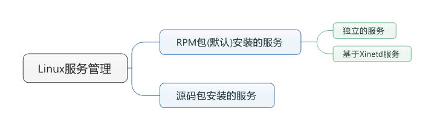
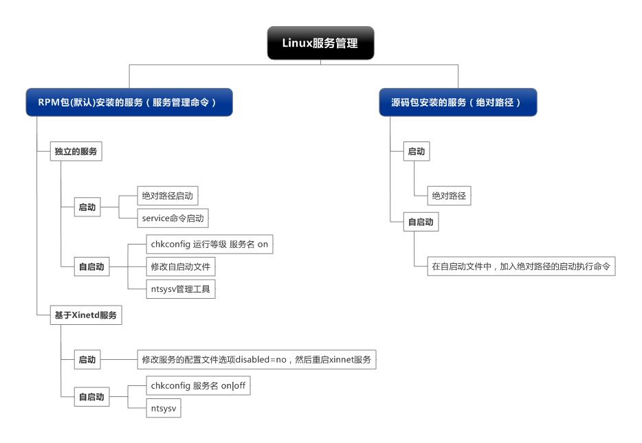

# 服务管理

	一、服务简介与分类
	二、RPM包安装服务的管理
		2.1 独立服务的管理
		2.2 基于xinetd服务的管理，xinetd是系统超级守护进程
	三、源码包安装服务的管理
	四、服务管理总结

## 一、服务简介与分类 ##
### 1.1 服务的分类 ###

### 1.2 启动、自启动 ###

- 服务启动：就是在当前系统中让服务运行，并提供功能。
- 服务自启动：自启动是指让服务在系统开机或重启动之后，随着系统的启动而自动启动服务。

### 1.3 系统运行级别 ###

/etc/inittab

<table width="100%">
	<caption>运行级别</caption>
	<tr>
		<th>运行级别</th>
		<th>含义</th>
	</tr>
	<tr>
		<td align="center">0</td>
		<td>关机</td>
	</tr>
	<tr>
		<td align="center">1</td>
		<td>单用户模式，可以想象为windows的安全模式，主要用于系统修复</td>
	</tr>
	<tr>
		<td align="center">2</td>
		<td>不完全的命令模式，不含NFS服务</td>
	</tr>
	<tr>
		<td align="center">3</td>
		<td>完全的命令行模式，就是标准字符界面</td>
	</tr>
	<tr>
		<td align="center">4</td>
		<td>系统保留</td>
	</tr>
	<tr>
		<td align="center">5</td>
		<td>图形模式</td>
	</tr>
	<tr>
		<td align="center">6</td>
		<td>重启动</td>
	</tr>
</table>

### 1.4 查询已安装的服务 ###

RPM包安装的服务

	chkconfig --list
	# 查看服务自启动状态，可以看到所有RPM包安装的服务。

源码包安装的服务

	查看服务安装位置，一般是在：/usr/local/下；如apache2

### 1.5 RPM安装服务和源码包安装服务的区别 ###

就是安装的位置的不同

- 源码包安装在指定的位置，一般是/usr/local
- RPM包安装在默认位置中(开发程序的已经指定好了)

`service` 等服务管理命令能够启动RPM包安装的服务的原因，是搜索 `/etc/rc.d/init.d` 目录。

## 二、RPM包安装服务的管理 ##
### 2.1 独立服务的管理 ###
#### 2.1.1 RPM包安装服务的位置 ####

RPM包安装在指定的位置，一般是/usr/local

`rpm -ql httpd`

<table width="100%">
	<tr>
		<th colspan="2">RPM包安装默认位置</th>
	</tr>
	<tr>
		<td>/etc/init.d</td>
		<td>启动脚本位置</td>
	</tr>
	<tr>
		<td>/etc/sysconfig</td>
		<td>初始化环境配置文件位置</td>
	</tr>
	<tr>
		<td>/etc/</td>
		<td>配置文件位置</td>
	</tr>
	<tr>
		<td>/etc/xinetd.conf</td>
		<td>xinetd配置文件</td>
	</tr>
	<tr>
		<td>/etc/xinetd.d</td>
		<td>基于xinetd服务的启动脚本</td>
	</tr>
	<tr>
		<td>/var/lib/</td>
		<td>服务产生的数据放在这里</td>
	</tr>
	<tr>
		<td>/var/log/</td>
		<td>日志</td>
	</tr>
</table>

#### 2.1.2 独立服务的启动 ####

- `/etc/init.d/独立服务名 start|stop|status|restart` 
- `service 独立服务名 start|stop|status|restart`

查看所有的RPM包安装的服务启动的状态：`service --status-all`

#### 2.1.3 独立服务的自启动 ####

- `chkconfig [--level 运行级别] [独立服务名] [on|off]`
- 修改/etc/rc.d/rc.local文件
- 使用ntsysv命令管理自启动

**方法2：**

- (1) `vim /etc/rc.d/rc.local`
- (2) 加入：`/etc/rc.d/init.d/httpd start`

注意：/etc/rc.d/rc.local 也有一个软链接 /etc/rc.local

**方法3：**

`ntsysv` 是RedHat专有的工具。只要是RPM包安装的服务都可以使用ntsysv工具管理自启动。

**推荐方法2的原因：**

- 统一规范，有利于查看
- 方法2不仅仅可以设置RPM包服务自启动，也可以设置源码包安装的服务。

### 2.2 基于xinetd服务的管理 ###
#### 2.2.1 安装xinetd与telnet ####

	yum -y install xinetd

	yum -y install telnet-server

#### 2.2.2 xinetd服务的启动 ####

`vim /etc/xinetd.d/telnet`

	# 配置示例：
	service rsync      # 服务的名称
	{
        disable = yes     # 服务不启动(修改为no)
        flags           = IPv6
        socket_type     = stream    # 使用TCP协议数据包
        wait            = no        # 允许多个链接同时连接
        user            = root      # 启动服务的用户为root
        server          = /usr/bin/rsync   #服务的启动程序
        server_args     = --daemon
        log_on_failure  += USERID   # 登录失败后，记录用户的ID
	}

重启xinnet服务：`service xinetd restart`

#### 2.2.3 xinetd服务的自启动 ####

- chkconfig telnet on
- ntsysv

> 注意：不同于RPM包独立服务的启动和自启动分别控制；xinnet服务的启动和自启动是相通的(如果设置启动，也就会自启动；设置关闭，自启动也会关闭；相互是相通的)。

## 三、源码包安装服务的管理 ##
### 3.1 源码包安装服务的启动 ###

使用绝对路径，调用启动脚本来启动。不同的源码包的启动脚本不同。可以查看源码包的安装说明，查看启动脚本的方法。

`/usr/local/apache2/bin/apachectl start|stop`

主要通过查看源码包提供的INSTALL/README信息

### 3.2 源码包安装服务的自启动 ###

	vim /etc/rc.d/rc.local
	加入
	/usr/local/apache2/bin/apachectl start

### 3.3 让源码包服务被服务管理命令识别 ###

- 步骤1：让源码包的apache服务能够被service命令管理启动

	ln -s /usr/local/apache2/bin/apachectl /etc/init.d/apache

- 步骤2：让源码包的apache服务能够被chkconfig与ntsysv命令管理自启动

	vim /etc/init.d/apache

**添加如下内容:**

	# chkconfig: 35 86 76
	# 指定httpd脚本可以被chkconfig命令管理。格式是：chkconfig: 运行级别 启动顺序 关闭顺序
	# description：source package apache
	# 说明信息

查看命令：`chkconfig --list | grep apache`

> 注意：启动顺序、关闭顺序不能和 `/etc/rc.d/rc3.d/` 文件里的序号重复。

- 步骤3：把源码包apache加入chkconfig命令 `chkconfig --add apache`

## 四、服务管理总结 ##

