# Linux权限管理之特殊权限 #

	一、课程概述
	二、文件基本权限 
		1) Linux文件权限的设定
		2) Linux文件权限的作用
		3) Linux中权限对目录的作用及案例演示
		4) Linux中其他权限命令
	三、默认权限
		1) Linux中文件默认权限
	四、ACL权限
		1) Linux中ACL权限简介与开启
		2) Linux中ACL权限查看与设定
		3) Linux中ACL最大权限与删除
		4) Linux中ACL默认权限与递归权限
	五、文件特殊权限
		1) Linux中SetUID
		2) Linux中SetGID
		3) Linux中Sticky BIT
	六、不可改变位权限
		1) Linux中不可改变位权限
	七、sudo权限
		1) Linux中sudo权限

## 一、课程概述 ##
### 1) 基本权限课程概述 ###
Linux服务器是多用户系统，只有一个管理员，剩余的所有用户都是普通用户，所以需要给普通用户分配合理的权限。

## 二、文件基本权限 ##
### 1) Linux文件权限的设定 ###

<table width="100%">
	<tr>
		<td class="center">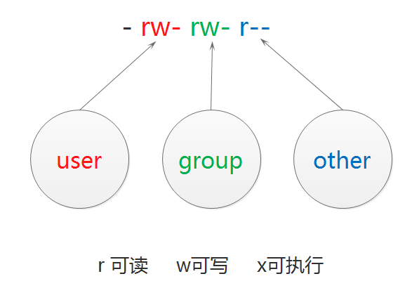</td>
	</tr>	
</table>

<table width="100%">
	<tr>
		<th>chmod [选项] 模式 文件名</th>
	</tr>
	<tr>
		<td>
			选项： 
			[-R] 递归
		</td>
	</tr>
	<tr>
		<td>
			模式： 
			[ugoa] [+-=] [rwx] 
			[mode=421]
		</td>
	</tr>
	<tr>
		<td>
			举例： 
			chmod u+x demo.txt 
			chmod g+w,o+w demo.txt 
			chmod a=rwx demo.txt
		</td>
	</tr>
</table>

#### 权限位的数字表示 ####
<table width="100%">
	<caption>权限位的数字表示</caption>
	<tr>
		<th width="33%">r</th>
		<th width="33%">w</th>
		<th>x</th>
	</tr>
	<tr>
		<td align="center">4</td>
		<td align="center">2</td>
		<td align="center">1</td>
	</tr>
	<tr>
		<td colspan="3" align="center">
			举例： 
			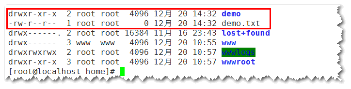 
		</td>
	</tr>
	<tr>
		<td>rwxr-xr-x</td>
		<td colspan="2">755</td>
	</tr>
	<tr>
		<td>rw-r--r--</td>
		<td colspan="2">644</td>
	</tr>
</table>

### 2) Linux文件权限的作用 ###
<table width="100%">
	<caption>Linux文件权限的作用</caption>
	<tr>
		<th width="10%"></th>
		<th width="45%">权限对文件的作用</th>
		<th width="45%">权限对目录的作用</th>
	</tr>
	<tr>
		<th>r</th>
		<td>读取文件内容 (cat, more, head, tail)</td>
		<td>可以查询目录下的文件名 (ls)</td>
	</tr>
	<tr>
		<th>w</th>
		<td>编辑、新增、修改文件内容 (vim, echo) 不包含删除文件</td>
		<td>具有修改目录结构的权限，如新建文件和目录，删除此目录下的文件和目录，重命名此目录下文件和目录，剪切 (touch, rm, mv, cp)</td>
	</tr>
	<tr>
		<th>x</th>
		<td>可执行</td>
		<td>可以进入目录 (cd)</td>
	</tr>
</table>

> 备注：目录所能赋的最高权限是w，一般可以设置为0，5(r-x)，7(rwx)，设置为其他如4(r--)，目录都无法进入，则没有意义。

### 3) Linux中权限对目录的作用及案例演示 ###

`whoami` 查看当前登录用户

<table width="100%">
	<tr>
		<th>案例演示</th>
	</tr>
	<tr>
		<td>
			
第一步：创建一个新用户 user1

			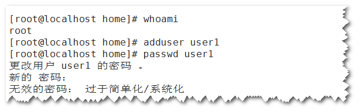
			
第二步：进入用户的家目录下，创建文件和目录，并设置权限为0

			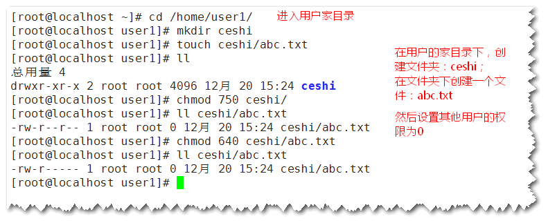
			
第三步：使用新用户登录后，访问上面创建的文件和目录，看权限的效果。

			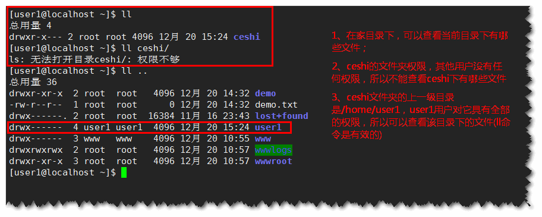
		</td>
	</tr>
</table>

### 4) Linux中其他权限命令 ###
#### 2.4.1 修改文件的所有者 ####

<table width="100%">
	<tr>
		<th>chown 用户名 文件名</th>
	</tr>
	<tr>
		<td>
			
# 修改文件的所有者

		</td>
	</tr>
	<tr>
		<td>
			举例： 
			chown user1 ceshi 
			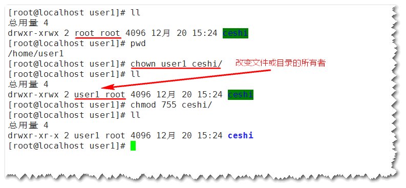
		</td>
	</tr>
</table>

#### 2.4.2 修改文件的所属组 ####

<table width="100%">
	<tr>
		<th>chgrp 组名 文件名</th>
	</tr>
	<tr>
		<td>
# 修改文件的所属组
</td>
	</tr>
	<tr>
		<td>
			举例： 
			chgrp user1 ceshi 或 chown root root ceshi 
			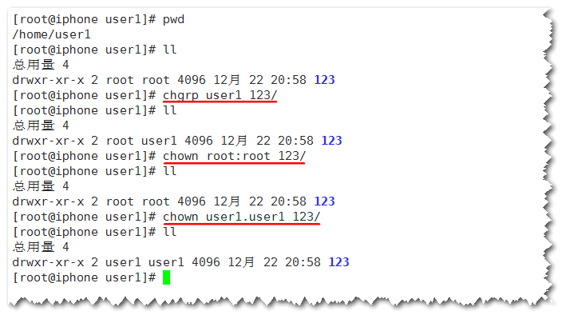
		</td>
	</tr>
</table>

**举例：使用权限设置实现下面的需求**

<ul>
	<li>在根目录创建一个文件夹av</li>
	<li>波哥有所有权限</li>
	<li>波哥的学员拥有只读权限</li>
	<li>其他用户没有任何权限</li>
</ul>

## 三、默认权限 ##
### 1) Linux中文件默认权限 ###
#### 3.1.1 查看默认权限的命令 ####
<table width="100%">
	<tr>
		<th>umask 查看默认权限</th>
	</tr>
	<tr>
		<td>
			0022 
			<ul>
				<li>第一位0：文件特殊权限</li>
				<li>022：文件默认权限</li>
			</ul>
		</td>
	</tr>
	<tr>
		<td align="center">
			
示例：

			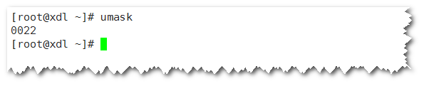
		</td>
	</tr>
</table>

#### 3.1.2 文件的默认权限 ####

- 文件默认不能建立为执行文件，必须手工赋予执行权限
- 所以文件默认权限最大为666
- 默认权限需要换算成字母再相减
- 建立文件之后的默认权限，为666减去umask值

<table width="100%">
	<tr>
		<th>例子1</th>
	</tr>
	<tr>
		<td>
			
文件默认最大权限666，umask值022

			
-rw-rw-rw- 减去 -----w--w- 等于 -rw-r--r--

		</td>
	</tr>
	<tr>
		<th>例子2</th>
	</tr>
	<tr>
		<td>
			
文件默认最大权限666，umask值033

			
-rw-rw-rw- 减去 -----wx-wx 等于 -rw-r--r--

			
备注：文件的默认最大权限改为033，创建的默认文件权限仍然是644

		</td>
	</tr>
	<tr>
		<td>
			实例：
			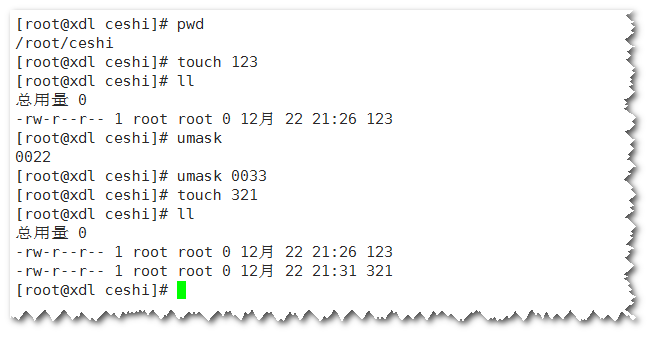
		</td>
	</tr>
</table>

#### 3.1.3 目录的默认权限 ####

目录默认权限最大为777
默认权限需要换算成字母再相减
建立文件之后的默认权限，为777减去umask值

<table width="100%">
	<tr>
		<th>例子</th>
	</tr>
	<tr>
		<td>
			
目录默认最大权限为777 umask值为022

			
-rwxrwxrwx 减去 ----w--w-- 等于 -rwxr-xr-x

		</td>
	</tr>
	<tr>
		<td>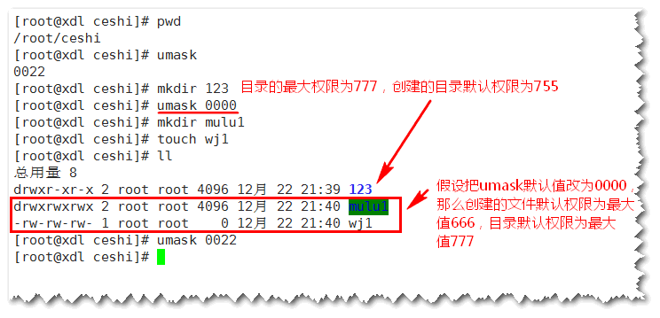</td>
	</tr>
</table>

#### 3.1.4 修改umask值 ####

<table width="100%">
	<tr>
		<th>umask 0002</th>
	</tr>
	<tr>
		<td>
# 临时修改
</td>
	</tr>
	<tr>
		<th>vi /etc/profile</th>
	</tr>
	<tr>
		<td>
# 永久修改

		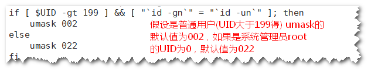
		</td>
	</tr>
</table>

## 四、ACL权限 ##
### 1) Linux中ACL权限简介与开启 ###

#### 4.1.1 什么是ACL ####

ACL是Access Control List的缩写，主要目的是提供传统的Owner, Group, Others的Read, Write, Execute权限之外的具体权限设置。ACL可以针对单一用户、单一文件或目录来进行r,w,x的权限设置，对于需要特殊权限的使用状况非常有帮助。

那ACL主要可以针对哪些方面来控制权限呢? 它主要可以针对几个项目：

- 用户(user) 可以针对用户来设置权限；
- 用户组(group) 针对用户组来设置其权限；
- 默认属性(mask) 还可以在该目录下在新建新文件/目录时设置新数据的默认权限。

<table width="100%">
	<tr>
		<td class="center">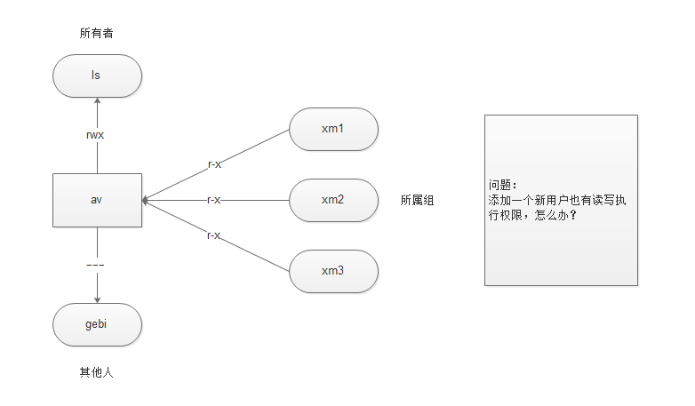</td>
	</tr>
</table>

#### 4.1.2 查看分区ACL权限是否开启 ####

<table width="100%">
	<tr>
		<th>dumpe2fs -h /dev/sda5</th>
	</tr>
	<tr>
		<td>
			
# dumpe2fs命令是查询指定分区详细文件系统信息

			选项： 
			[-h] 仅显示超级块中信息，而不显示磁盘块组的详细信息
		</td>
	</tr>
</table>

#### 4.1.3 临时开启分区ACL权限 ####
CentOS 5.x默认就帮你假如acl的支持了，但是如果你的系统默认不会帮你加上acl的支持，你可以这样操作：

<table width="100%">
	<tr>
		<th>mount -o remount,acl /</th>
	</tr>
	<tr>
		<td>
# 重新挂载根分区，并挂载加入acl权限
</td>
	</tr>
</table>

#### 4.1.4 永久开启分区ACL权限 ####

	vim /etc/fstab

	# 修改如下，default后面加,acl
	UUID=e76a7b8d-20c2-4f94-bdd1-f4054a34c206 / ext4 defaults,acl,barrier=0 1 1

	mount -o remount/
	# 重新挂载文件系统或重启系统，使修改生效

<table width="100%">
	<tr>
		<th>vim /etc/fstab</th>
	</tr>
	<tr>
		<td>实例： 
		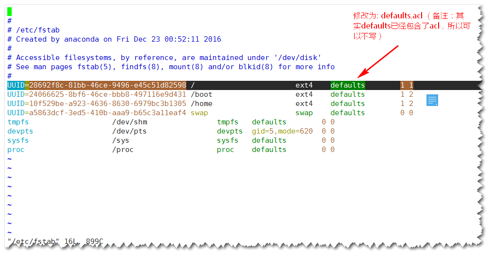
		</td>
	</tr>
	<tr>
		<th>mount -o remount /</th>
	</tr>
	<tr>
		<td>
# 重新挂载文件系统或重启动系统，使修改生效
</td>
	</tr>
</table>

### 2) Linux中ACL权限查看与设定 ###
#### 4.2.1 查看ACL命令 ####

<table width="100%">
	<tr>
		<th>getfacl 文件名</th>
	</tr>
	<tr>
		<td>
# 查看ACL
</td>
	</tr>
</table>

#### 4.2.2 设定ACL权限的命令 ####
<table width="100%">
	<tr>
		<th>setfacl 选项 文件名</th>
	</tr>
	<tr>
		<td>
			
# 设定ACL权限

			选项： 
			[-m] 设定ACL权限 
			[-x] 删除指定的ACL权限 
			[-b] 删除所有的ACL权限 
			[-d] 设定默认ACL权限 
			[-k] 删除默认ACL权限 
			[-R] 递归设定ACL权限
		</td>
	</tr>
</table>

#### 4.2.3 给用户设定ACL权限 ####

<table width="100%">
	<tr>
		<td class="center">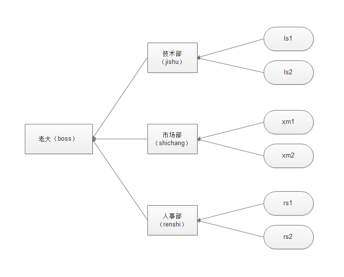</td>
	</tr>
</table>

	mkdir /project
	chmod 777 /project
	chown ls:stu /project
	useradd lw

	setfacl -m u:lw:rwx /project
	# 给用户lw设置rwx权限, 使用“u:用户名:权限”格式

#### 4.2.4 给用户组设定ACL权限 ####

	groupadd stu
	setfacl -m g:stu:r-x /project
	# 给用户组stu设置r-x权限, 使用“g:用户组:权限”格式

### 3) 最大有限权限与删除ACL权限 ###
#### 4.3.1 最大有效权限mask ####

mask是用来指定最大有效权限的。如果我给用户赋予了ACL权限，是需要和mask的权限“相与”才能得到用户的真正权限

	[lw@xdl project]$ getfacl /project/
	getfacl: Removing leading '/' from absolute path names
	# file: project/
	# owner: ls
	# group: xueyuan
	user::rwx
	user:lw:rwx
	group::r-x
	mask::rwx
	other::---

<table width="100%">
	<tr>
		<th width="33%">A</th>
		<th width="33%">B</th>
		<th width="33%">“相与”</th>
	</tr>
	<tr>
		<td class="center">r</td>
		<td class="center">r</td>
		<td class="center">r</td>
	</tr>
	<tr>
		<td class="center">r</td>
		<td class="center">-</td>
		<td class="center">-</td>
	</tr>
	<tr>
		<td class="center">-</td>
		<td class="center">r</td>
		<td class="center">-</td>
	</tr>
	<tr>
		<td class="center">-</td>
		<td class="center">-</td>
		<td class="center">-</td>
	</tr>
</table>

**修改最大有效权限**

	setfacl -m m:rx 文件名
	# 设定mask权限为r-x，使用“m:权限”格式

#### 4.3.2 删除ACL权限 ####

	setfacl -x u:用户名 文件名
	# 删除指定用户的ACL权限

	setfacl -x g:组名 文件名
	# 删除指定用户组的ACL权限

	setfacl -b 文件名
	# 会删除文件的所有的ACL权限

### 4) 默认ACL权限与递归ACL权限 ###

#### 4.4.1 递归ACL权限 ####

- 递归是父目录在设定ACL权限时，所有的子文件和子目录也会拥有相同的ACL权限。
- setfacl -m u:用户名:权限 -R 文件名

注意：

1. 目录需要赋予x权限，递归后，目录下的文件也有x权限，这是这个方式的弊端，即“权限溢出”。(要少用)
2. 但是递归仅仅对已有的文件有效，而"新建的文件"，是没有权限的，需要使用默认ACL权限

#### 4.4.2 默认ACL权限 ####

- 默认ACL权限的作用是如果给父目录设定了默认ACL权限，那么父目录中所有新建的子文件都会继承父目录的ACL权限
- setfacl -m d:u:用户名:权限 文件名

效果如下：

	[root@xdl /]# getfacl /project/
	getfacl: Removing leading '/' from absolute path names
	# file: project/
	# owner: ls
	# group: xueyuan
	user::rwx
	user:lw:rwx
	group::r-x
	mask::rwx
	other::---
	default:user::rwx
	default:user:lw:rwx
	default:group::r-x
	default:mask::rwx
	default:other::---

## 五、文件特殊权限 ##

特殊权限尽量少使用

### 5.1 SetUID ###

#### 5.1.1 SetUID的功能 ####

- 只有可以执行的二进制程序才能设定SUID权限
- 命令执行者要对该程序拥有x(执行)权限
- 命令执行者在执行该程序时获得该程序文件属主的身份(在执行程序的过程中灵魂附体为文件的属主)
- SetUID权限只在改程序执行过程中有效，也就是说身份改变只在程序执行过程中有效
- passwd命令拥有SetUID权限，所有普通可以修改自己的密码
- cat命令没有SetUID权限，所以普通用户不能查看/etc/shadow文件内容

如下：

	[root@xdl ~]# ll /usr/bin/passwd 
	-rwsr-xr-x. 1 root root 25980 Feb 22  2012 /usr/bin/passwd

	[root@xdl ~]# ll /bin/cat 
	-rwxr-xr-x 1 root root 47976 Jun 25  2014 /bin/cat

命令：
	
	chmod 4775 123.txt

<table width="100%">
	<tr>
		<td class="center">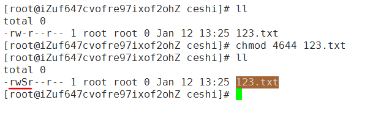</td>
	</tr>
</table>

#### 5.1.2 设定SetUID的方法 ####

4代表SUID

	chmod 4755 文件名
	chmod u+s 文件名

#### 5.1.3 取消SetUID的方法 ####

	chmod 755 文件名
	chmod u-s 文件名

#### 5.1.4 危险的SetUID ####

- 关键目录应严格控制写权限。比如："/", "/usr"等
- 用户的密码设置要严格遵守密码三原则
- 对系统中默认应该具有SetUID权限的文件作一列表，定时检查有没有这之外的文件被设置了SetUID权限

### 5.2 SetGID ###

#### 5.2.1 SetGID针对文件的作用 ####

- 只有可执行的二进制程序才能设置SGID权限
- 命令执行者要对改程序拥有x(执行)权限
- 命令执行在执行程序的时候，组身份升级为该程序文件的数组
- SetGID权限同样只在该程序执行过程中有效，也就是说组身份改变只在程序执行过程中有效

#### 5.2.2 SetGID针对目录的作用 ####

- 普通用户必须对此目录拥有r和x权限，才能进入此目录
- 普通用户在此目录中的有效组会变成此目录的属组
- 若普通用户对此目录拥有w权限时，新建的文件的默认属组是这个目录的属组

如下：

	[root@xdl ~]# ll /usr/bin/locate
	-rwx--s--x 1 root slocate 35548 Oct 10  2012 /usr/bin/locate
	
	[root@xdl ~]# ll /var/lib/mlocate/mlocate.db
	-rw-r----- 1 root slocate 3470642 Jan 11 04:07 /var/lib/mlocate/mlocate.db

说明：

- /usr/bin/locate是可执行二进制程序，可以赋予SGID
- 执行用户xm1对/usr/bin/locate命令拥有执行权限
- 执行/usr/bin/locate命令时，组身份会升级为slocate组，而slocate组对/var/lib/mlocate/mlocate.db数据库拥有r权限，所以普通用户可以使用locate命令查询mlocate.db数据库
- 命令结束，xm1用户的组身份返回为xm1组

#### 5.2.3 设定SetGID ####

**2代表SUID**

	chmod 2755 文件名
	chmod g+s 文件名

#### 5.2.4 取消SetGID####

	chmod 755 文件名
	chmod g-s文件名

### 5.3 Sticky BIT ###

#### 5.3.1 SBIT粘着位作用 ####

- 粘着位目前只对目录有效
- 普通用户对该目录拥有w和x权限，即普通用户可以在此目录拥有写入权限
- 如果没有粘着位，因为普通用户拥有w权限，所以可以删除此目录下所有文件，包括其他用户建立的文件。一但赋予了粘着位，除了root可以删除所有文件，普通用户就算拥有w权限，也只能删除自己建立的文件，但是不能删除其他用户建立的文件

如下：

	[root@xdl ~]# ll -d /tmp/
	drwxrwxrwt. 3 root root 4096 Jan 11 04:07 /tmp/

#### 5.3.2 设置与取消粘着位 ####

**设置粘着位：**

	chmod 1755 目录名
	chmod o+t 目录名

**取消粘着位：**

	chmod 777 目录名
	chmod o-t 目录名

## 六、不可改变位权限 ##
### 1) Linux中不可改变位权限 ###

## 七、sudo权限 ##
### 7.1 sudo权限 ###

- root把本来只能超级用户执行的命令赋予普通用户执行
- sudo的操作对象是系统命令

### 7.2 sudo使用 ###

	visudo
	# 实际修改的是/etc/sudoers文件

	root    ALL=(ALL)       ALL
	# 用户名 被管理主机的地址 = (可使用的身份) 授权命令(绝对路径)
	
	# %wheel        ALL=(ALL)       ALL
	#%组名 被管理主机的地址 = (可使用的身份) 授权命令(绝对路径)

### 7.3 授权xm1用户可以重启服务器 ###

	visudo
	xm1 ALL=(ALL) /sbin/shutdown -r now

### 7.4 普通用户执行sudo赋予的命令 ###

	su - xm1
	sudo -l
	# 查看可用的sudo命令
	
	sudo /sbin/shutdown -r now
	# 普通用户执行sudo赋予的命令

	# 结果如下：
	[webjust@xdl ~]$ sudo -l
	[sudo] password for webjust: 
	Matching Defaults entries for webjust on this host:
	    requiretty, !visiblepw, always_set_home, env_reset, env_keep="COLORS DISPLAY HOSTNAME HISTSIZE INPUTRC KDEDIR LS_COLORS", env_keep+="MAIL PS1
	    PS2 QTDIR USERNAME LANG LC_ADDRESS LC_CTYPE", env_keep+="LC_COLLATE LC_IDENTIFICATION LC_MEASUREMENT LC_MESSAGES", env_keep+="LC_MONETARY
	    LC_NAME LC_NUMERIC LC_PAPER LC_TELEPHONE", env_keep+="LC_TIME LC_ALL LANGUAGE LINGUAS _XKB_CHARSET XAUTHORITY",
	    secure_path=/sbin\:/bin\:/usr/sbin\:/usr/bin

	User webjust may run the following commands on this host:
	    (ALL) /sbin/shutdown -r now

### 7.5 授权普通用户可以添加新用户 ###

思考题?