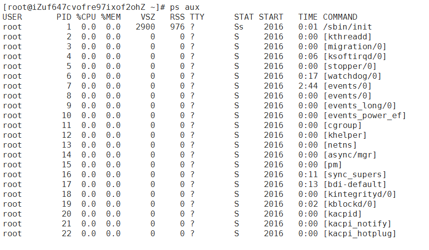
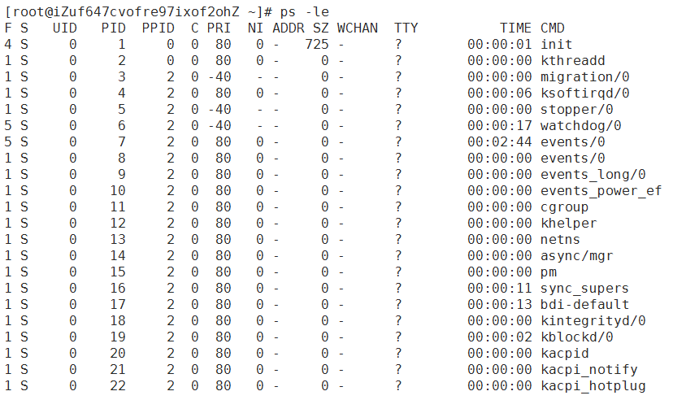
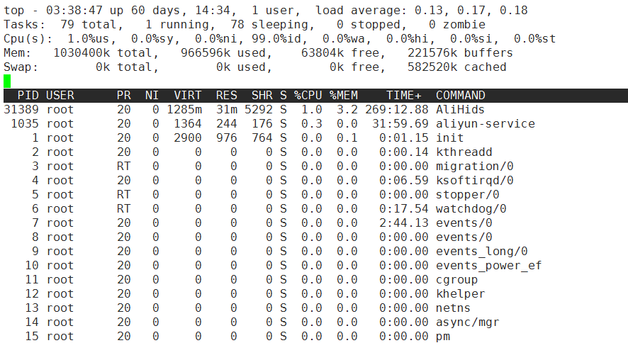
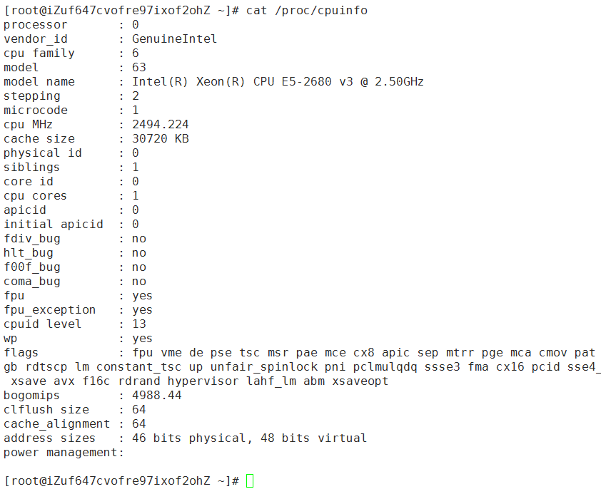

# Linux系统管理 #

	一、进程管理
		(1) 进程查看
		(2) 终止进程

	二、工作管理
	三、系统资源查看
	四、系统定时任务

## 一、进程管理 ##
### (1) 进程查看 ###
#### 1.1.1 进程简介 ####

进程 (process) 是正在执行的一个程序或命令，每一个进程都是一个运行的实体，都有自己的地址空间，并占用一定的系统资源。

#### 1.1.2 进程管理的作用 ####

<ul>
	<li>判断服务器健康状态</li>
	<li>查看系统中所有进程</li>
	<li>杀死进程</li>
</ul>

#### 1.1.3 查看系统中所有进程 ####

	ps aux
	# 查看系统中所有进程，使用BSD操作系统格式 (常用)

	ps -le
	# 查看系统中所有进程，使用Linux标准命令格式

<table width="100%">
	<tr>
		<td></td>
	</tr>
	<tr>
		<td></td>
	</tr>
</table>

<table width="100%">
	<tr>
		<td>USER</td>
		<td>该进程是由哪个用户产生的</td>
	</tr>
	<tr class="red">
		<td>PID</td>
		<td>进程的ID号</td>
	</tr>
	<tr>
		<td>%CPU</td>
		<td>该进程占用CPU资源的百分比，占用越高，进程越耗费资源</td>
	</tr>
	<tr>
		<td>%MEM</td>
		<td>该进程占用物理内存的百分比，占用越高，进程越耗费资源</td>
	</tr>
	<tr>
		<td>VSZ</td>
		<td>该进程占用虚拟内存的大小，单位为KB</td>
	</tr>
	<tr>
		<td>RSS</td>
		<td>该进程占用实际物理内存的大小，单位为KB</td>
	</tr>
	<tr>
		<td>TTY</td>
		<td>该进程实在哪个终端运行的。其中tty1-tty7代表本地控制台终端，tty1-tty6是本地的字符界面终端，tty7是图形终端。pts/0~256代表虚拟终端</td>
	</tr>
	<tr>
		<td>STAT</td>
		<td>进程状态。常见的状态有：R：运行、S：睡眠、T：停止状态、s：包含子进程、+：位于后台</td>
	</tr>
	<tr>
		<td>START</td>
		<td>该进程的启动时间</td>
	</tr>
	<tr>
		<td>TIME</td>
		<td>该进程占用CPU的运算时间，注意不是系统时间</td>
	</tr>
	<tr>
		<td>COMMAND</td>
		<td>产生此进程的命令名</td>
	</tr>
</table>

> 备注：在本地控制台终端的切换键是：[alt] + [F1 ~ F7]

#### 1.1.4 查看系统健康状态 ####

<table width="100%">
	<tr>
		<th>top [选项]</th>
	</tr>
	<tr>
		<td>选项： 
		[-d 秒数] 指定top命令每隔几秒更新。默认是3秒  

		交互命令： 
		[? 或 h] 显示交互帮助信息 
		[P] 以CPU使用率排序，默认 
		[M] 以内存的使用率排序 
		[N] 以PID排序 
		[q] 退出top
		</td>
	</tr>
	<tr>
		<td></td>
	</tr>
</table>

**第一行：任务队列信息**

<table width="100%">
	<tr>
		<th>内容</th>
		<th>说明</th>
	</tr>
	<tr>
		<td>03:38:47</td>
		<td>系统当前时间</td>
	</tr>
	<tr>
		<td>up 60 days, 14:34</td>
		<td>系统的运行时间，本机已经运行60天，14小时34分钟</td>
	</tr>
	<tr>
		<td>1 user</td>
		<td>当前登录了1个用户</td>
	</tr>
	<tr>
		<td>load average: 0.13, 0.17, 0.18</td>
		<td>系统在之前1分钟，5分钟，15分钟的平均负载。一般认为是小于1时，负载较小。如果大于1，系统已经超出负荷。</td>
	</tr>
</table>

**第二行：进程信息**

<table width="100%">
	<tr>
		<th>内容</th>
		<th>说明</th>
	</tr>
	<tr>
		<td>Tasks: 79 total</td>
		<td>系统中的进程总数</td>
	</tr>
	<tr>
		<td>1 running</td>
		<td>系统中正在运行的进程数</td>
	</tr>
	<tr>
		<td>78 sleeping</td>
		<td>睡眠的进程</td>
	</tr>
	<tr>
		<td>0 stopped</td>
		<td>正在停止的进程</td>
	</tr>
	<tr>
		<td>0 zombie</td>
		<td>僵死进程。如果不是0，需要手工检查僵死进程</td>
	</tr>
</table>

**第三行：CPU信息**

<table width="100%">
	<tr>
		<th>内容</th>
		<th>说明</th>
	</tr>
	<tr>
		<td>Cpu(s): 1.0%us</td>
		<td>用户模式占用的CPU百分比</td>
	</tr>
	<tr>
		<td>0.0%sy</td>
		<td>系统模式占用的CPU百分比</td>
	</tr>
	<tr>
		<td>0.0%ni</td>
		<td>改变过优先级的用户进程占用的CPU百分比</td>
	</tr>
	<tr>
		<td>99.0%id</td>
		<td>空闲CPU的CPU百分比</td>
	</tr>
	<tr>
		<td>0.0%wa</td>
		<td>等待输入/输出的进程的占用CPU百分比</td>
	</tr>
	<tr>
		<td>0.0%hi</td>
		<td>硬中断请求服务占用的CPU百分比</td>
	</tr>
	<tr>
		<td>0.0%si</td>
		<td>软中断请求服务占用的CPU百分比</td>
	</tr>
	<tr>
		<td>0.0%st</td>
		<td>st(Steal time) 虚拟时间百分比。就是当有虚拟机时，虚拟CPU等待实际CPU的时间百分比</td>
	</tr>
</table>

**第四行：物理内存信息**

<table width="100%">
	<tr>
		<th>内容</th>
		<th>说明</th>
	</tr>
	<tr>
		<td>Mem: 1030400k total</td>
		<td>物理内存的总量，单位为KB</td>
	</tr>
	<tr>
		<td>966596k used</td>
		<td>已经使用的物理内存数量</td>
	</tr>
	<tr>
		<td>63804k free</td>
		<td>空闲的物理内存数量</td>
	</tr>
	<tr>
		<td>221576k buffers</td>
		<td>作为缓冲的内存数量</td>
	</tr>
</table>

**第五行：swap交换分区信息**

<table width="100%">
	<tr>
		<th>内容</th>
		<th>说明</th>
	</tr>
	<tr>
		<td>Swap: 0k total</td>
		<td>交换分区(虚拟内存)的总大小</td>
	</tr>
	<tr>
		<td>0k used</td>
		<td>已经使用的交换分区的大小</td>
	</tr>
	<tr>
		<td>0k free</td>
		<td>空闲交换分区的大小</td>
	</tr>
	<tr>
		<td>582520k cached</td>
		<td>作为缓存的交换分区的大小</td>
	</tr>
</table>

#### 1.1.5 查看进程树 ####

<table width="100%">
	<tr>
		<th>pstree [选项]</th>
	</tr>
	<tr>
		<td>选项： 
		[-p] 显示进程的PID 
		[-u] 显示进程的所属用户
		</td>
	</tr>
</table>

### (2) 终止进程 ###
#### 1.2.1 kill命令 ####
kill命令用来删除执行中的程序或工作。kill可将指定的信息送至程序。预设的信息为SIGTERM(15),可将指定程序终止。若仍无法终止该程序，可使用SIGKILL(9)信息尝试强制删除程序。程序或工作的编号可利用ps指令或job指令查看。

<table width="100%">
	<tr>
		<th colspan="3">kill -l 查看可用的进程信号</th>
	</tr>
	<tr>
		<td class="center">信号代表</td>
		<td class="center">信号名称</td>
		<td class="center">说明</td>
	</tr>
	<tr>
		<td>1</td>
		<td>SIGHUP</td>
		<td>该信号让进程立即关闭，然后重新读取配置文件之后重启</td>
	</tr>
	<tr>
		<td>2</td>
		<td>SIGINT</td>
		<td>程序终止信号，用于终止前台进程。相当于输出`ctrl+c`快捷键</td>
	</tr>
	<tr>
		<td>8</td>
		<td>SIGFPE</td>
		<td>在发生致命的算术运算错误时发出，不仅包括浮点运算错误，还包括溢出及除数为0等其他所有的算术的错误</td>
	</tr>
	<tr class="red">
		<td>9</td>
		<td>SIGKILL</td>
		<td>用来立即结束程序的运行。本信号不能被阻塞、处理和忽略。一般用于强制终止进程</td>
	</tr>
	<tr>
		<td>14</td>
		<td>SIGALRM</td>
		<td>时钟定时信号，计算的是实际的时间或时钟时间。alarm函数使用该信号。</td>
	</tr>
	<tr>
		<td>15</td>
		<td>SIGTERM</td>
		<td>正常结束进程的信号，kill命令的默认信号。有时如果进程已经发生问题，这个信号是无法正常终止进程的，我们才会尝试SIGKILL，也就是信号9。</td>
	</tr>
	<tr>
		<td>18</td>
		<td>SIGCONT</td>
		<td>该信号可以让暂停的进程恢复执行，本信号不能被阻断。</td>
	</tr>
	<tr>
		<td>19</td>
		<td>SIGSTOP</td>
		<td>该信号可以暂停前台进程，相当于输入`ctrl+z`快捷键。本信号不能被阻断。</td>
	</tr>
</table>

	kill PID
	# 不带信号，默认信号是15，正常杀死

	kill [-1] PID
	# 重启进程

	kill [-9] PID
	# 强制杀死进程

#### 1.2.2 killall命令 ####
killall命令使用进程的名称来杀死进程，使用此指令可以杀死一组同名进程。我们可以使用kill命令杀死指定进程PID的进程，如果要找到我们需要杀死的进程，我们还需要在之前使用ps等命令再配合grep来查找进程，而killall把这两个过程合二为一，是一个很好用的命令。

<table width="100%">
	<tr>
		<th>killall [选项][信号] 进程名</th>
	</tr>
	<tr>
		<td>
# 按照进程名杀死进程
</td>
	</tr>
	<tr>
		<td>选项： 
		[-i] 交互式，询问是否要杀死某个进程
		[-I] 忽略进程名的大小写
		</td>
	</tr>
</table>

#### 1.2.3 pkill命令 ####
pkill命令可以按照进程名杀死进程。pkill和killall应用方法差不多，也是直接杀死运行中的程序；如果您想杀掉单个进程，请用kill来杀掉。

<table width="100%">
	<tr>
		<th>pkill [选项][信号] 进程名</th>
	</tr>
	<tr>
		<td>
# 按照进程名终止进程
</td>
	</tr>
	<tr>
		<td>选项： 
		[-t 终端号] 按照终端号踢出用户
		</td>
	</tr>
</table>

	w 或 who
	# 使用w命令，查询本机已经登录的用户

	pkill -9 -t pts/2
	# 强制杀死从pts/2虚拟终端登录的进程

## 二、工作管理 ##
### (1) 把进程放入后台 ###
在指令后面添加符号&

	tar -zcf cdrom.tar.gz /mnt/cdrom &
	# 压缩光盘，请先挂载光盘

	top
	# 在top命令执行的过程中，按下`ctrl + z`快捷键

### (2) 查看后台的工作 ###
jobs命令用于显示Linux中的任务列表及任务状态，包括后台运行的任务。该命令可以显示任务号及其对应的进程号。其中，任务号是以普通用户的角度进行的，而进程号则是从系统管理员的角度来看的。一个任务可以对应于一个或者多个进程号。

在Linux系统中执行某些操作时候，有时需要将当前任务暂停调至后台，或有时须将后台暂停的任务重启开启并调至前台，这一序列的操作将会使用到 jobs、bg、和 fg 三个命令以及两个快捷键来完成。

<table width="100%">
	<tr>
		<th>jobs [-l]</th>
	</tr>
	<tr>
		<td>选项： 
		[-l] 显示工作的PID
		</td>
	</tr>
	<tr>
		<td><em>注意："+"号：代表最近一个放入后台的工作，也是工作恢复时，默认恢复的工作。 "-"号：代表倒数第二个放入后台的工作。</em></td>
	</tr>
</table>

输出信息的第一列表示任务编号，第二列表示任务所对应的进程号，第三列表示任务的运行状态，第四列表示启动任务的命令。

### (3) 将后台暂停的工作恢复到前台执行 ###

<table width="100%">
	<tr>
		<th>fg %工作号</th>
	</tr>
	<tr>
		<td>选项： 
		[%工作号] %号可以省略，但是注意工作号与PID是有区别的。
		</td>
	</tr>
</table>

### (4) 把后台暂停的工作恢复到后台执行 ###

<table width="100%">
	<tr>
		<th>bg %工作号</th>
	</tr>
	<tr>
		<td><em>注意：后台恢复执行的命令，是不能喝前台有交互的，否则不能恢复到后台执行。</em></td>
	</tr>
</table>

## 三、系统资源查看 ##
### (1) vmstat命令监控系统资源 ###
vmstat命令的含义为显示虚拟内存状态（“Viryual Memor Statics”），但是它可以报告关于进程、内存、I/O等系统整体运行状态。

<table width="100%">
	<tr>
		<th>vmstat [刷新延时 刷新次数]</th>
	</tr>
	<tr>
		<td>例如： 
		vmstat 1 3
		</td>
	</tr>
</table>

	[root@localhost ~]# vmstat 1 3
	procs -----------memory---------- ---swap-- -----io---- --system-- -----cpu-----
	 r  b   swpd   free   buff  cache   si   so    bi    bo   in   cs us sy id wa st
	 1  0      0  14408 105092 818020    0    0   686   609   83  103  2  3 92  2  0	
	 1  0      0  15524 105096 816908    0    0 20054     0 1163 1768 56 44  0  0  0	
	 2  0      0  13912 105096 818540    0    0 19752    20 1171 1753 78 22  0  0  0	

### (2) dmesg开机时内核检测信息 ###
dmesg命令被用于检查和控制内核的环形缓冲区。kernel会将开机信息存储在ring buffer中。您若是开机时来不及查看信息，可利用dmesg来查看。开机信息保存在/var/log/dmesg文件里。

<table width="100%">
	<tr>
		<th>dmesg</th>
	</tr>
	<tr>
		<td>举例： 
			dmesg | grep CPU 
			dmesg | head
		</td>
	</tr>
</table>

### (3) free命令查看内存使用状态 ###
free命令可以显示当前系统未使用的和已使用的内存数目，还可以显示被内核使用的内存缓冲区。

<table width="100%">
	<tr>
		<th>free [-b|-k|-m|-g]</th>
	</tr>
	<tr>
		<td>选项： 
		[-b] 以字节为单位显示 
		[-k] 以KB为单位显示，默认就是以KB为单位显示 
		[-m] 以MB为单位显示 
		[-g] 以GB为单位显示
		</td>
	</tr>
</table>

	[root@localhost ~]# free -m
	             total       used       free     shared    buffers     cached
	Mem:          1006        606        400          0        102        413
	-/+ buffers/cache:         89        916
	Swap:         1999          0       1999

#### 第一部分Mem行解释:

- total：内存总数； 
- used：已经使用的内存数； 
- free：空闲的内存数； 
- shared：当前已经废弃不用； 
- buffers Buffer：缓存内存数； 
- cached Page：缓存内存数。

### (4) 查看CPU信息 ###

<table width="100%">
	<tr>
		<th>cat /proc/cpuinfo</th>
	</tr>
	<tr>
		<td></td>
	</tr>
</table>

### (5) uptime命令：查看系统负载 ###
uptime命令能够打印系统总共运行了多长时间和系统的平均负载。uptime命令可以显示的信息显示依次为：现在时间、系统已经运行了多长时间、目前有多少登陆用户、系统在过去的1分钟、5分钟和15分钟内的平均负载。

<table width="100%">
	<tr>
		<th>uptime</th>
	</tr>
	<tr>
		<td>
# 显示系统的启动时间和平均负载，也就是top命令的第一行。w命令也可以看这个数据。
</td>
	</tr>
</table>

### (6) 查看系统与内核相关信息 ###
uname命令用于打印当前系统相关信息（内核版本号、硬件架构、主机名称和操作系统类型等）。

<table width="100%">
	<tr>
		<th class="red">uname [选项]</th>
	</tr>
	<tr>
		<td>
		
# 查看系统的信息。

		选项： 
		[-a] 查看系统所有相关信息 
		[-r] 查看内核版本 
		[-s] 查看内核名称
		</td>
	</tr>
	<tr>
		<th>file /bin/ls</th>
	</tr>
	<tr>
		<td># 判断当前该系统的位数</td>
	</tr>
	<tr>
		<th>lsb_release -a</th>
	</tr>
	<tr>
		<td># 判断当前Linux系统的发行版本</td>
	</tr>
</table>

备注：主机名

	hostname
	# 查看主机名

	hostname xdl
	# 设置临时主机名

	# 修改配置文件的hostname选项(.的前面是主机名，后面是域名，或者直接用主机名省略域名)，可以设置永久主机名，分2步：
	vim /etc/sysconfig/network
	vim /etc/hosts
	shutdown -r now     // 重启后生效

### (7) 列出进程打开或使用的文件信息 ###
lsof命令用于查看你进程打开的文件，打开文件的进程，进程打开的端口(TCP、UDP)。找回/恢复删除的文件。是十分方便的系统监视工具，因为lsof命令需要访问核心内存和各种文件，所以需要root用户执行。 

在linux环境下，任何事物都以文件的形式存在，通过文件不仅仅可以访问常规数据，还可以访问网络连接和硬件。所以如传输控制协议 (TCP) 和用户数据报协议 (UDP) 套接字等，系统在后台都为该应用程序分配了一个文件描述符，无论这个文件的本质如何，该文件描述符为应用程序与基础操作系统之间的交互提供了通用接口。因为应用程序打开文件的描述符列表提供了大量关于这个应用程序本身的信息，因此通过lsof工具能够查看这个列表对系统监测以及排错将是很有帮助的。

<table width="100%">
	<tr>
		<th class="red">lsof [选项]</th>
	</tr>
	<tr>
		<td>
			
# 列出进程调用或打开的文件的信息

			选项： 
			[-c 字符串] 只列出以字符串开头的进程打开的文件 
			[-u 用户名] 只列出某个用户的进程打开的文件 
			[-p pid] 列出某个PID进程打开的文件
		</td>
	</tr>
</table>

#### lsof输出各列信息的意义如下： 

- COMMAND：进程的名称 
- PID：进程标识符 
- PPID：父进程标识符（需要指定-R参数） 
- USER：进程所有者 
- PGID：进程所属组 
- FD：文件描述符，应用程序通过文件描述符识别该文件。

## 四、系统定时任务 ##

	(1) at一次性定时任务
	(2) crontab循环定时任务
	(3) 系统的crontab设置
	(4) anacron配置

### (1) at一次性定时任务 ###

#### 1.1 确定at安装  ####

	chkconfig --list | grep atd
	# at服务是否安装、自启动设置

	service atd status
	# at服务的启动状态

#### 1.2 at的访问控制 ####

- 如果系统中有/etc/at.allow文件，那么只有写入/etc/at.allow文件中的用户才可以使用at命令(/etc/at.deny文件则忽略)

- 如果系统中没有/etc/at.allow文件，只有/etc/at.deny文件，那么写入/etc/at.deny文件中的用户不能使用at命令。

- 如果系统中这2个文件都不存在，那么只有root用户可以使用at命令

#### 1.3 at命令 ####

<table width="100%">
	<tr>
		<th>at [选项] 时间</th>
	</tr>
	<tr>
		<td>
			选项： 
			[-m] 当at工作完成后，无论是否命令有输出，都用email通知执行at命令的用户 
			[-c] 工作号：显示该at工作的实际内容
		</td>
	</tr>
	<tr>
		<td>
			时间： 
			<ul>
				<li>HH:MM</li>
				<li>HH:MM YYYY-MM-DD</li>
				<li>HH:MM[am|pm] [month] [date]</li>
				<li>HH:MM[am|pm] + [minutes|hours|days|weeks]</li>
			</ul>

			例子： 
			<ul>
				<li>15:30</li>
				<li>15:30 2017-01-12</li>
				<li>15:30 July 11</li>
				<li>now + 5 minutes</li>
			</ul>
		</td>
	</tr>
</table>

#### 1.4 例子 ####

**例子1：**

	at now + 1 minutes
	# 在两分钟后执行hello.sh脚本

注意：

- 在at命令行，ctrl + 退格键可以撤销
- 必须赋予脚本执行的权限 (重要！！！！！)

hello.sh 脚本示例：
	
	#!/bin/sh
	date > hello.txt

**例子1：**

	at 15:30 2017-01-15
	# 在指定的时间重启
	at> /bin/sync
	# 数据同步
	at> /sbin/shutdown -r now
	# 到点重启服务器
	at> [EOT]
	# 按「ctrl + d」结束

#### 1.5 其他at管理命令 ####

	atq
	# 查询当前服务器上的at工作

	atrm [工作号]
	# 删除指定的at任务

	at -c [工作号]
	# 显示已经设置的任务内容

计划任务设定后，在没有执行之前我们可以用atq命令来查看系统没有执行工作任务。

### (2) crontab循环定时任务 ###

#### 2.1 crond服务管理与访问控制 ####

	service crond restart
	# 重启 crond 服务

	chkconfig crond on
	# 设置 crond 服务自启动

**crontab 访问控制**

- 当系统中有/etc/cron.allow文件时，只有写入此文件的用户可以使用crontab命令，没有写入的用户不能使用crontab命令。同样如果有此文件，/etc/cron.deny文件会被忽略，/etc/cron.allow文件的优先级更高。

- 当系统中只有/etc/cron.deny文件时，则写入此文件的用户不能使用crontab命令，没有写入文件的用户可以使用crontab命令。

#### 2.2 用户的crontab设置 ####

<table width="100%">
	<tr>
		<th>crontab [选项]</th>
	</tr>
	<tr>
		<td>
			选项： 
			[-e] 编辑crontab定时任务 
			[-l] 查询crontab任务 
			[-r] 删除当前用户所有的crontab任务
		</td>
	</tr>
</table>

	crontab -e
	# 进入crontab编辑界面，会打开vim编辑你的工作。 *****

<table width="100%">
	<tr>
		<th>项目</th>
		<th>含义</th>
		<th>范围</th>
	</tr>
	<tr>
		<td>第一个"*"</td>
		<td>分</td>
		<td>0-59</td>
	</tr>
	<tr>
		<td>第一个"*"</td>
		<td>小时</td>
		<td>0-23</td>
	</tr>
	<tr>
		<td>第一个"*"</td>
		<td>一个月中第几天</td>
		<td>1-31</td>
	</tr>
	<tr>
		<td>第一个"*"</td>
		<td>一年当中第几个月</td>
		<td>1-12</td>
	</tr>
	<tr>
		<td>第一个"*"</td>
		<td>一周的第几天</td>
		<td>0-7 (0,7都表示周日)</td>
	</tr>
</table>

<table width="100%">
	<tr>
		<th>时间</th>
		<th>含义</th>
	</tr>
	<tr>
		<td>45 22 * * *</td>
		<td>22点45分</td>
	</tr>
	<tr>
		<td>0 17 * * 1</td>
		<td>每周1的17点00分</td>
	</tr>
	<tr>
		<td>0 5 1,15 * *</td>
		<td>每月1号和15号的凌晨5:00</td>
	</tr>
	<tr>
		<td>40 4 * * 1-5</td>
		<td>每周一至周五的凌晨4:40</td>
	</tr>
	<tr>
		<td>*/10 4 * * *</td>
		<td>每天的凌晨4点，每隔10分钟</td>
	</tr>
</table>

#### 2.3 例子 ####

	*/5 * * * * /bin/echo "11" >> /tmp/test

	5 5 * * 2 /sbin/shutdown -r now
	# 定时重启

	0 5 1,10,15 * * /root/sh/autobak.sh
	# 定时备份

注意：

	0 5 * * *
	# 每天5点整，如果写错：* 5 * * *，表示是每隔5小时

#### 2.4 crontab注意事项 ####
minute hour day month week command 顺序：分 时 日 月 周

- 六个选项都不能为空，必须填写。如果不确定使用“*”代表任意时间。
- crontab定时任务，最小有效时间是分钟，最大时间范围是月。像2018年某个时间，1点10分10秒这样的时间都不能识别。
- 在定义时间时，日期和星期最好不要在一条定时任务中出现，因为他们都是以天作为单位，非常容易让管理员混乱。
- 在定时任务中，不管是直接写命令，还是在脚本中写，最好都使用绝对路径。

更多示例参考：<http://man.linuxde.net/crontab>

**题目：**

在2017年2-3月间，每天7点00分执行一条命令

### (3) 系统的crontab设置 ###

#### 系统的定时任务 ####

“crontab -e”是每个用户执行的命令，也就是说不同的身份用户可以执行自己的定时任务。可是有些定时任务需要系统执行，这就需要编辑/etc/crontab这个配置文件了。

#### CentOS 5中的配置文件 ####

	vim /etc/crontab

	SHELL=/bin/bash
	PATH=/sbin:/bin:/usr/sbin:/usr/bin
	MAILTO=root
	HOME=/

	# run-parts
	01 * * * * root run-parts /etc/cron.hourly
	02 4 * * * root run-parts /etc/cron.daily
	22 4 * * * root run-parts /etc/cron.weekly
	42 4 1 * * root run-parts /etc/cron.monthday

#### 执行系统的定时任务的方法 ####

- 手工执行定时任务
- 系统定时任务
	- 第一种是把需要定时执行的脚本复制到/etc/cron.{daily,weekly,monthly}目录中的任意一个

	- 第二种是修改/etc/crontab配置文件

### (4) anacron配置 ###

#### anacron是什么 ####

anacron是用来保证在系统关机的时候错过的定时任务，可以在系统开机之后再执行。

#### anacron检测周期 ####

- anacron会使用一天，七天，一个月作为检测周期
- 在系统的/var/spool/anacron/目录中存在cron.{daily,weekly,monthly}文件，用于记录上次执行cron的时间。
- 和当前时间做比较，如果两个时间的差值超过了anacron的指定时间差值，证明有cron任务被执行

#### anacron配置文件 ####

vi /etc/anacrontab

#### cron.daily工作来说明执行过程 ####

- 首先读取/var/spool/anacron/cron.daily中的上一次anacron执行的时间
- 和当前时间比较，如果两个时间的差值超过1天，就执行cron.daily工作
- 执行这个工作职能在03:00 - 22:00之间
- 执行工作时强制延迟时间为5分钟，再随机延迟0-45分钟时间
- 使用nice命令指定默认优先级，使用run-parts脚本执行/etc/cron.daily目录中的所有可执行文件