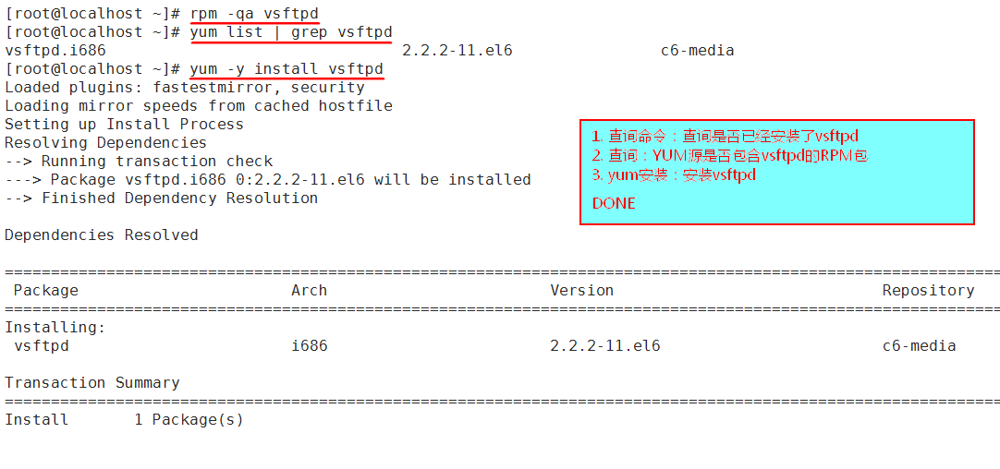
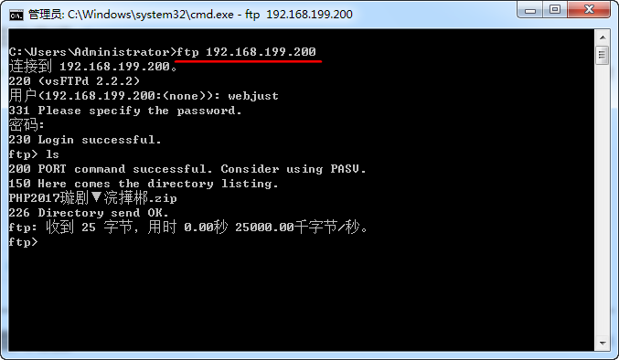
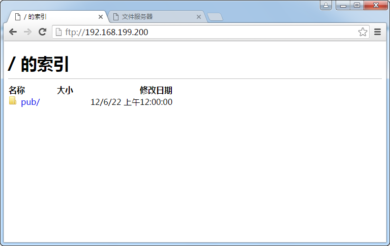
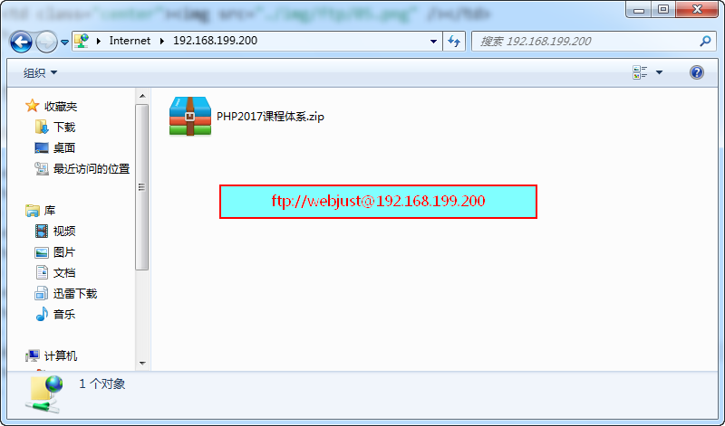
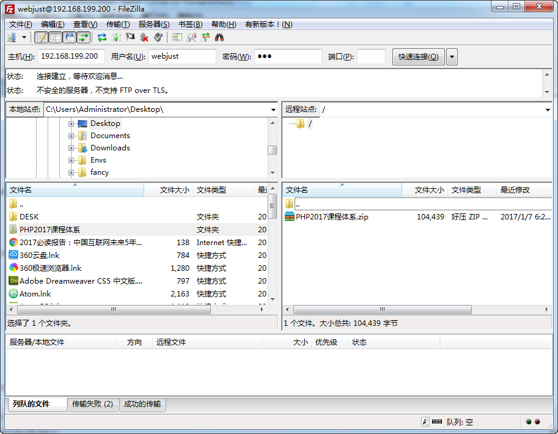
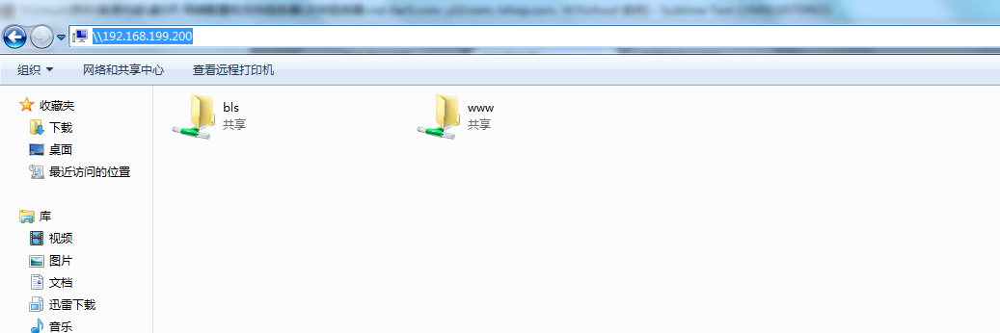
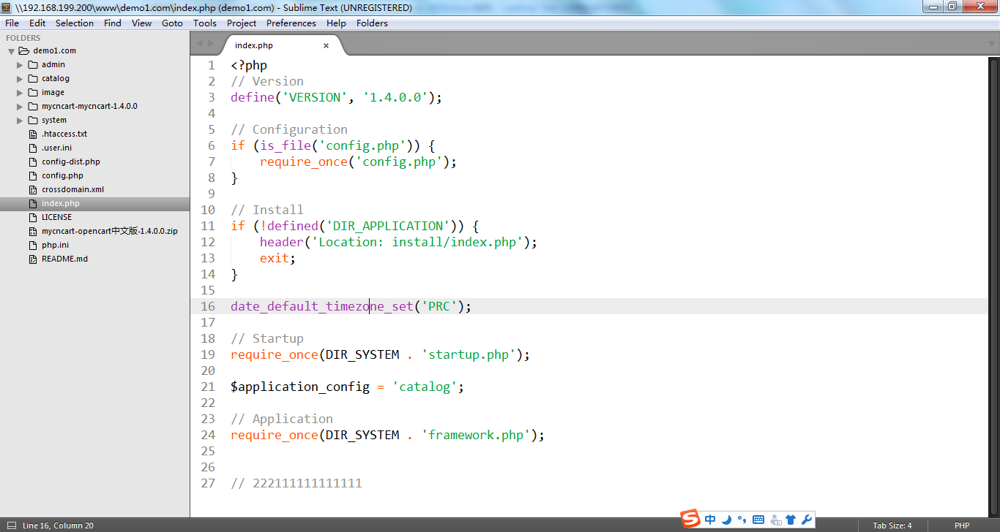

# 文件服务器 #

## VSFTP服务 ##

### 一、文件服务器简介 ###

<table width="100%">
	<tr>
		<th>FTP</th>
		<th>Samba</th>
	</tr>
	<tr>
		<td>上传、下载的服务器</td>
		<td>在window和linux之间共享文件</td>
	</tr>
	<tr>
		<td>在内网和公网使用。</td>
		<td>只能在内网使用 （文件共享服务）</td>
	</tr>
	<tr>
		<td>服务器：windows，linux</td>
		<td>服务器：windows，linux</td>
	</tr>
	<tr>
		<td>客户端：windows，linux</td>
		<td>客户端：windows</td>
	</tr>
</table>

**服务器搭建流程：**

1. 下载、安装FTP软件   
2. 修改FTP配置文件

### 1.1 ftp软件###

<table width="100%">
	<caption>FTP软件</caption>
	<tr>
		<th>Linux</th>
		<th>Windows</th>
	</tr>
	<tr>
		<td>
			<ul>
				<li>wu-ftp: 早期，不太安全，现在少用</li>
				<li>proftp: 增强ftp工具</li>
				<li>vsftp: 安全，强大  centos自带</li>
			</ul>
		</td>
		<td>
			<ul>
				<li>windows	IIS: windows下网页搭建服务，可以搭建ftp服务</li>
				<li>Serv-U: 专用ftp服务器</li>
			</ul>
		</td>
	</tr>
</table>

### 1.2 原理 ###

原理：进行FTP文件传输，客户端首先连接到FTP服务器的21端口，进行用户认证，认证成功后，要传输文件时，服务器会开一个20端口来进行传输数据。

<table width="100%">
	<tr>
		<th>状态</th>
		<th>端口</th>
		<th>作用</th>
	</tr>
	<tr>
		<td>开启</td>
		<td>21</td>
		<td>用于连接</td>
	</tr>
	<tr>
		<td>默认ftp端口</td>
		<td>20</td>
		<td>数据传输</td>
	</tr>
</table>

### 1.3 ftp的用户 ###
1. ftp允许系统用户登录, 使用密码也是系统密码登录, 上传位置：`/home/家目录`。

2. 匿名用户	anonymous。密码：空 (或者邮箱地址11@bls)，上传位置：`/var/ftp/pub`。

## 二、安装软件包 ##

安装前使用查询命令，查询vsftpd是否已经安装：`rpm -q vsftpd`

以下安装方式任选1种：

	# RPM安装命令(vsftp软件非常小，无依赖性)
	`rpm -ivh vsftpd包全名`

	# YUM安装RPM包，自动解决依赖性
	`yum -y install vsftpd`

<table width="100%">
	<tr>
		<th>vsftpd软件的安装</th>
	</tr>
	<tr>
		<td class="center"></td>
	</tr>
</table>

## 三、相关文件 ##

<table width="100%">
	<tr>
		<td>/etc/vsftpd/vsftpd.conf</td>
		<td>配置文件</td>
	</tr>
	<tr>
		<td>/etc/vsftpd/ftpusers</td>
		<td>用户访问控制文件, 写入此文件的用户都不能访问ftp服务器</td>
	</tr>
	<tr>
		<td>/etc/vsftpd/chroot_list</td>
		<td>需要手工建立: 定义是否把用户限制在家目录</td>
	</tr>
</table>

## 四、配置文件配置 ##

> 注意：修改配置文件后, 需要重启服务。

	`vim /etc/vsftpd/vsftpd.conf`

**1) 主机相关配置**

	listen_port=21			    #监听端口
	connect_from_port_20=YES	#数据传输端口
	ftpd_banner=				#欢迎信息

**2) 匿名用户登录**			

在linux下识别为: ftp 用户

	anonymous_enable=YES		#允许匿名用户登录

**3) 本地用户**

	local_enable=YES			#允许系统用户登录
	write_enable=YES			#允许上传
	local_umask=022			    #默认上传权限
	local_max_rate=300			#上传限速(配置文件没有)

**4) 限制用户访问目录**

	chroot_local_user=YES		#只有此句，所有用户限制在家目录下
	
	chroot_local_user=YES		#如有三句话，只有文件chroot_list中的用户
	可以访问任何目录，其他用户限制在家目录
	chroot_list_enable=YES
	chroot_list_file=/etc/vsftpd/chroot_list			
	
	useradd  zhangsan 
	passwd   zhangsan 

**ftp配置实例详细步骤：** 

<table width="100%">
	<tr>
		<th>步骤1：`vim /etc/vsftpd/vsftpd.conf`</th>
	</tr>
	<tr>
		<td class="center">打开 chroot_local_user=YES 这个选项 (在97行)</td>
	</tr>
	<tr>
		<th>步骤2：重启vftpds服务</th>
	</tr>
	<tr>
		<td class="center">`service vsftpd restart`</td>
	</tr>
	<tr>
		<th>步骤3：关闭防火墙</th>
	</tr>
	<tr>
		<td class="center">`setup`</td>
	</tr>
	<tr>
		<th>步骤4：禁用SELINUX</th>
	</tr>
	<tr>
		<td class="center">`vim /etc/selinux/config`, 修改这个为 SELINUX=disabled
			# SELINUX是为了增强linux安全性。
		</td>
	</tr>
	<tr>
		<th>步骤5：修改SELINUX后，需要重启生效</th>
	</tr>
	<tr>
		<td class="center">`reboot` 或 `shutdown -r now`</td>
	</tr>
	<tr>
		<th>步骤6：启动vsftpd服务</th>
	</tr>
	<tr>
		<td class="center">`service vsftpd start`</td>
	</tr>
</table>

## 五、ftp客户端使用 ##

	(1) 关闭防火墙：setup

	(2) 禁用SELinux
	`vim /etc/selinux/config `
	# SELINUX=enforcing改成disabled
	# 需要重启linux

	(3) 重启服务: `service vsftpd restart`

### 5.1 使用命令登录 ###

	ftp  ip

	get  文件名		下载
	put  文件名		上传		不能上传和下载目录  

	help   查看ftp的命令

例子：

<table width="100%">
	<tr>
		<th>使用CMD登录</th>
	</tr>
	<tr>
		<td class="center"></td>
	</tr>
</table>

### 5.2 使用windows窗口或者浏览器 ###

例子：

<table width="100%">
	<tr>
		<th>使用windows窗口</th>
	</tr>
	<tr>
		<td class="center"></td>
	</tr>
	<tr>
		<th>使用windows窗口: ftp://用户名@IP</th>
	</tr>
	<tr>
		<td class="center"></td>
	</tr>
</table>

### 5.3 使用第三方工具登录 ###

- FileZilla
- xftp

例子：

<table width="100%">
	<tr>
		<th class="red">FileZilla登录</th>
	</tr>
	<tr>
		<td class="center"></td>
	</tr>
</table>

## samba服务器 ##

### 一、简介 ###

Samba是在Linux和UNIX系统或者Window实现文件共享的免费软件。

### 二、端口 ###

- smbd：为clinet提供资源访问		tcp  139  
- 类似于ftp的20端口，用于传输数据

- nmbd：提供netbios主机名解析的		upd  137  138
- nmdb类似于DNS

### 三、安装相关程序 yum ### 

	yum -y install samba samba-client smaba-common

安装完成后会有以下两个配置文件：

	samba-common		主要配置文件
	
	samba-client		客户端文件

### 四、相关文件 ###

	/etc/samba/smb.conf		配置文件		#  和  ; 注释

### 五、服务器段配置 ###

	vim /etc/samba/smb.conf

	// 示例：给Nginx的根目录配置一个共享目录

	[web]                                  # 自定义节点
	comment = 网站根目录                   # 备注
	path = /home/wwwroot                   # Nginx主目录
	writable = yes                         # 是否可写
	browseable = yes                       # 是否可浏览
	valid users = bls, www                 # 允许的用户

常见配置选项：	

	[global]
	workgroup  =  工作组
	server  string  =  描述
	log  file  =	日志位置
	max  log  size  =  日志最大大小 			KB
	security  =  user		安全等级
	user	使用samba用户登录。注意：samba用户由系统用户转变过来。要把用户生成为samba用户，此用户必须已经是系统用户
	share	不用密码
	server	使用验证服务器验证

#### 添加一个共享文件夹 ####

	[共享目录名]
	Comment  =  目录描述
	browseable  =  yes		目录是否对用户可见
	writeable  =  yes		可写（要与系统目录权限相与）
	valid users  =  用户名	用户限制（目录是哪个用户所有）
	path  =  /www			指定共享目录位置

### 六、把系统用户声明为samba用户 ###

	smbpasswd  -a  系统用户名
	smbpasswd  -a  bls   //将bls这个系统用户声明为samba用户
	
	smbpasswd  -x  用户名		删除samba用户
	
	pdbedit  -L	查看samba用户

### 七、重启服务 ###

	service  smb  restart
	service  nmb  restart

注意：

1. samba权限和系统权限取最严格权限
2. samba用户必须是系统用户
3. 启动的服务名是smb

例子：

共享两个目录，一个是pub 位置在 /pub 所有用户都能访问，所有用户都能上传。

另一个目录是 soft 位置在  /soft	只有bls用户能访问，上传(写), 其他用户不能访问。

soft 700 chown bls /soft  

**配置samba的完整步骤**

	yum -y install samba

	1. vi /etc/samba/smb.conf   在文件末尾添加以下内容：

		[pub]
		browseable = yes
		path = /pub
		writable = yes
		
		[soft]
		browseable = yes
		path = /soft
		writable = yes

	2. 按照这个命令来设置

		mkdir  /pub
		mkdir  /soft
		chmod 777 /pub
		chmod 700 /soft
		useradd bls 
		passwd bls
		chown bls  /soft

	3. smbpasswd  -a  bls   // 将bls这个系统用户声明为samba用户

	4. 重启服务

		service  smb  restart
		service  nmb  restart

	5. 访问samba服务器

** 到 windows 系统下访问 **

### 八、客户端使用 ###

windows：共享目录

	net use * /del			// 删除缓存

linux客户端：

	smbclient //192.168.140.251/soft -U 用户名

### 九、文件服务器总结： ###

#### 1. vsftp 服务器：linux  windows   

客户端：linux  windows 

使用范围：内网  外网

共享目录：普通用户是用户家目录，匿名用户是/var/ftp/目录。不能手工指定

登录用户：系统用户，使用系统密码登录

#### 2. samba：服务器：linux	windows	

客户端:linux  windows

使用范围：内网

共享目录：手工指定

登录用户：系统用户，使用samba密码登录

**********************

### 波哥分享：如何在Windows上开发，和Linux上源代码保持同步 ###

案例演示：

#### 1. 添加samba用户：smbpasswd  -a  bls

#### 2. 配置smaba配置文件：

	vim /etc/samba/smb.conf

	// 示例：给Nginx的根目录配置一个共享目录

	[web]                                  # 自定义节点
	comment = 网站根目录                   # 备注
	path = /home/wwwroot                   # Nginx主目录
	writable = yes                         # 是否可写
	browseable = yes                       # 是否可浏览
	valid users = bls                      # 允许的用户

#### 3. 设置项目文件夹ACL权限

	setfacl -R -m u:bls:rwx 目标文件夹
	setfacl -R -m d:bls:rwx 目标文件夹          // 新建的文件也拥有rwx权限

#### 4. 实现在Windows上使用sublime开发，同步到Linux上。

