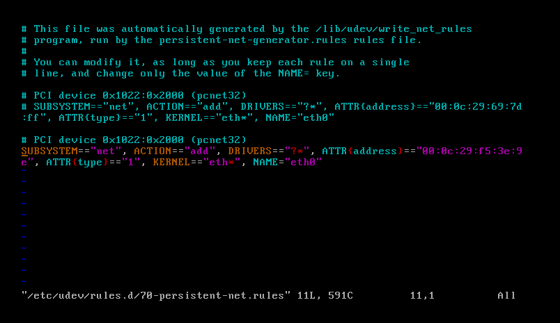
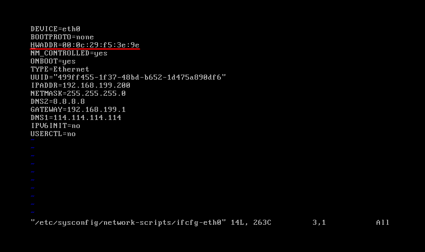

# CentOS 6.3 克隆虚拟机无法上网解决办法

用VMware克隆CentOS 6.3后，发现系统内只有eth1,而且/etc/sysconfig/network-scripts/下只有，ifcfg-eth0文件，虽然可以上网，但无法设置静态IP。

	ifconfig eth0
	eth1: error fetching interface information: Device not found

解决：vim /etc/udev/rules.d/70-persistent-net.rules 显示为：

	# PCI device 0x8086:0x100f (e1000)
	SUBSYSTEM=="net", ACTION=="add", DRIVERS=="?*", ATTR{address}=="00:0c:29:48:85:9c", ATTR{type}=="1", KERNEL=="eth*", NAME="eth1"

将 NAME="eth1" 改成NAME="eth0"

并将 ATTR{address}=="00:0c:29:48:85:9c",中的网卡地址改到/etc/sysconfig/network-scripts/ifcfg-eth0 文件中，HWADDR="00:0C:29:48:85:9C"，使他们对应。

然后reboot