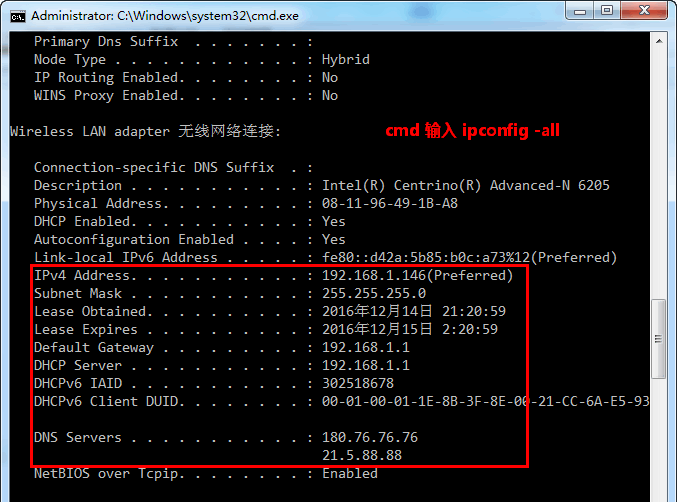
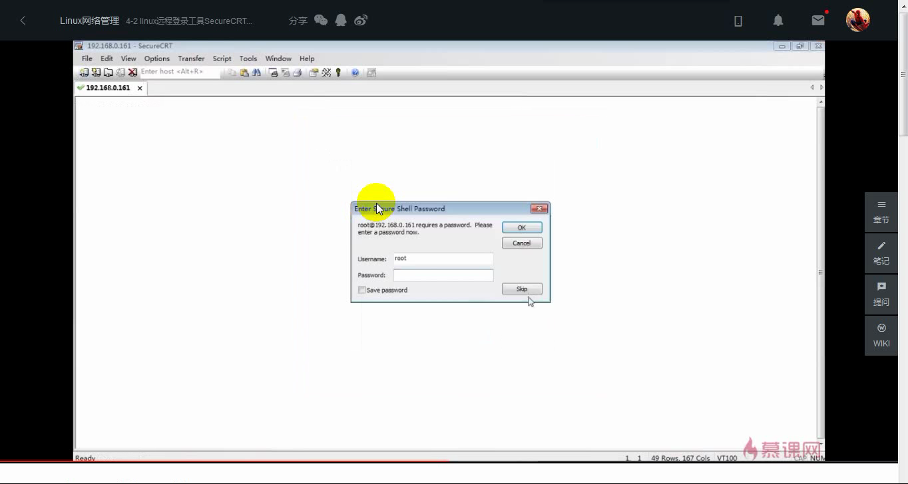

# Linux网络管理 #

	一、网络基础
	二、Linux网络配置
		2.1 Linux配置IP地址
		2.2 虚拟机网络参数配置
	三、Linux网络命令
		3.1 网络环境查看命令
		3.2 网络测试命令
	四、远程登录工具
		4.1 SSH协议原理
		4.2 SecureCRT远程管理工具
		4.3 Xshell工具和WinSCP文件传输工具

## 一、网络基础 ##
IP地址：	Ipv4	     Ipv6 

tcp  	   网络通讯协议   

协议：  大家都遵守的规则。

udp		   用户数据报协议

协议：HTTP协议、tcp/ip协议、udp协议

协议：大家都遵守一种协议（规则）  

常见网络端口：

21	ftp服务		文件共享

22		ssh服务		安全远程网络管理

23		telnet服务  以后连接内存（memcache  内存缓存）的时候用到

25 		smtp：简单邮件传输协议	发信

110		pop3：邮局协议			收信

80		www	网页服务 

3306		mysql端口

53		DNS端口

/etc/services			所有系统常见端口

端口数量 	tcp  65535		udp  65535

网关：(Gateway)网间连接器、协议转换器。

DNS：	  域名解释系统

域名	 	-->		IP		正向解析

IP		-->	   域名		反向解析

北京网通：202.106.0.20   

广州电信：202.96.128.143    

114DNS：114.114.114.114

## 二、Linux网络配置 ##
### 2.1 Linux配置IP地址 ###
#### 2.1.1：ifconfig命令临时配置IP地址 ####

<table width="100%">
	<tr>
		<th>ifconfig eth0 ip地址</th>
	</tr>
	<tr>
		<td></td>
	</tr>
</table>

`ifconfig eth0 192.168.0.200 netmask 255.255.255.0`

#### 2.1.2：setup工具永久配置IP地址 ####

<table width="100%">
	<tr>
		<th>setup工具</th>
	</tr>
	<tr>
		<td class="center"> 
		 
		 
		 
		
		</td>
	</tr>
</table>

设置IP地址：
`setup`

重启网络服务，使用setup配置的ip地址才会生效(注意：需要先手动修改网卡的配置项：ONBOOT=yes)

`service network restart`

#### 2.1.3：修改Linux网络配置文件 ####
<table width="100%">
	<tr>
		<th>修改Linux网络配置文件</th>
	</tr>
	<tr>
		<td class="red center">文件1：网卡信息文件</td>
	</tr>
	<tr>
		<td class="center">
vim /etc/sysconfig/network-scripts/ifcfg-eth0

		</td>
	</tr>
	<tr>
		<td class="center">文件2：主机名文件</td>
	</tr>
	<tr>
		<td class="center">
			
vim /etc/sysconfig/network

			命令：hostname [主机名]

			# 查看与临时设置主机名命令

			
		</td>
	</tr>
	<tr>
		<td class="center">文件3：DNS配置文件</td>
	</tr>
	<tr>
		<td class="center">
			
vim /etc/resolv.conf

			
		</td>
	</tr>
</table>

### 2.2 虚拟机网络参数配置 ###

1、配置IP地址

2、启动网卡

3、修改UUID(复制或克隆安装的系统才需要修改)

> 亲测有效：修改MAC地址即可，不需要修改UUID。步骤见下文

VMware虚拟机克隆CentOS 6.5后网卡修改方法：<a href="http://www.linuxidc.com/Linux/2015-03/114975.htm">http://www.linuxidc.com/Linux/2015-03/114975.htm</a>

4、设置虚拟机网络连接方式

5、修改桥接网卡

## 三、Linux网络命令 ##
### 3.1 网络环境查看命令 ###

1. `ifconfig` # 查看与配置网络状态命令
2. 关闭和启动网卡：`ifdown 网卡设备名` # 禁用该网卡 和 `ifup 网卡设备名` # 启用该网卡
3. `netstat` 选项：-t, -u, -n, -l, -n # 查询状态命令
4. `route` 查看或设置路由命令
5. `nslookup` 域名解析命令

<table width="100%">
	<tr>
		<th>ifconfig</th>
	</tr>
	<tr>
		<td class="center">
			
查看与配置网络状态命令

			
		</td>
	</tr>
	<tr>
		<th>关闭和启动网卡</th>
	</tr>
	<tr>
		<td>
			
ifdown 网卡设备名

			# 禁用该网卡设备 
			

			
ifup 网卡设备名

			# 启用该网卡设备 
			 

			
		</td>
	</tr>
	<tr>
		<th>netstat 选项</th>
	</tr>
	<tr>
		<td>
			选项： 
			[-t] 列出TCP协议端口 
			[-u] 列出UDP协议端口 
			[-n] 不适用域名与服务名，而使用IP地址和端口号 
			[-l] 仅列出在监听状态网络服务 
			[-p] 列出所有的网络连接 
			[-r] 列出路由列表，功能和route命令一致
		</td>
	</tr>
	<tr><td class="center"></td></tr>
	<tr><td class="center"></td></tr>
	<tr>
		<th>route -n</th>
	</tr>
	<tr>
		<td>
查询路由列表。(可以查看网关)
</td>
	</tr>
	<tr><td class="center"></td></tr>
	<tr>
		<td>
			实例： 
			route  add   default  gw  192.168.140.1			手工设定网关，临时生效 
			route  del   default  gw  192.168.190.6				删除网关
		</td>
	</tr>
	<tr>
		<th>nslookup [主机名或IP]</th>
	</tr>
	<tr>
		<td>
# 进行域名与IP地址解析 (不带参数，输入server可以查看DNS)

		
		</td>
	</tr>

</table>

### 3.2 网络测试命令 ###

1. `ping` 探测指定IP或域名的网络状况
2. `telnet` 远程管理与端口探测命令
3. `traceroute` 路由跟踪命令
4. `wget` 下载命令
5. `tcpdump`

<table width="100%">
	<tr>
		<th>ping [选项] IP或域名</th>
	</tr>
	<tr>
		<td>
			
# 探测指定IP或域名的网络状况

			选项： 
			[-c] 次数：指定ping包的次数
		</td>
	</tr>
	<tr>
		<td>
			
ping  ip	  -c 次数  -s  数据包大小		探测网络通畅

			数据包大小不能大于65507 

			ping    用来测试网络是否联通，A ping  B 
			A会给B发送一个数据包(数据),如果B没有down机(死机)，就会响应一下内容回来。
		</td>
	</tr>
	<tr>
		<td></td>
	</tr>
	<tr>
		<th>telnet [域名或IP] [端口]</th>
	</tr>
	<tr>
		<td>
# 远程管理与端口探测命令

		明文传输，不够安全[已淘汰] 被SSH取代
		</td>
	</tr>
	<tr>
		<th>traceroute [选项] IP或域名</th>
	</tr>
	<tr>
		<td>
# 路由跟踪命令。探测/跟踪网络数据包的传输路径

		选项： 
		[-n] 使用IP，不使用域名，速度更快 

		
超时返回*

		
tracert www.baidu.com (CMD)

		</td>
	</tr>
	<tr>
		<td class="center"></td>
	</tr>
	<tr>
		<th>wget 文件地址</th>
	</tr>
	<tr>
		<td>下载命令：wget https://nodejs.org/dist/v6.9.2/node-v6.9.2.tar.gz</td>
	</tr>
	<tr>
		<td></td>
	</tr>
	<tr>
		<th>tcpdump -i eth0 -nnX port 21</th>
	</tr>
	<tr>
		<td>
			选项： 
			[-i] 指定网卡接口 
			[-nn] 将数据包中的域名与服务转为IP和端口 
			[-X] 以十六进制和ASCII码显示数据包内容 
			[port] 指定监听的端口
		</td>
	</tr>
</table>

## 四、远程登录工具 ##
### 4.1 SSH协议原理 ###
 
 
 
 
 

### 4.2 SecureCRT远程管理工具 ###

### 4.3 Xshell工具和WinSCP文件传输工具 ###
#### Xshell ####

#### WinSCP ####

*****